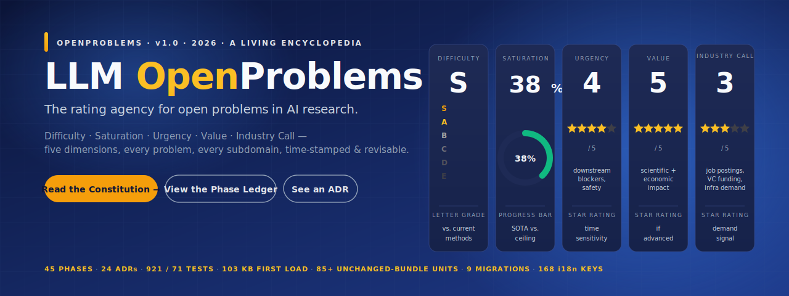
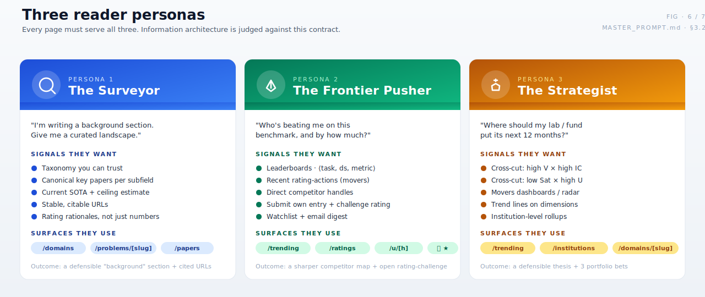
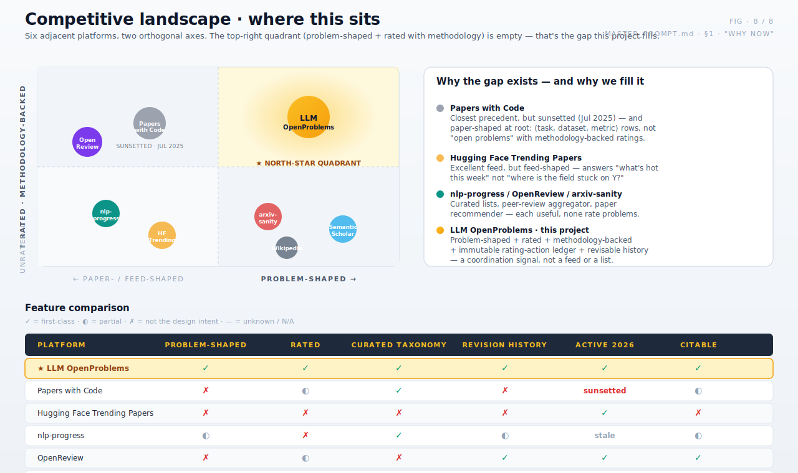
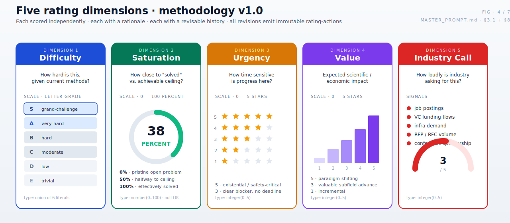
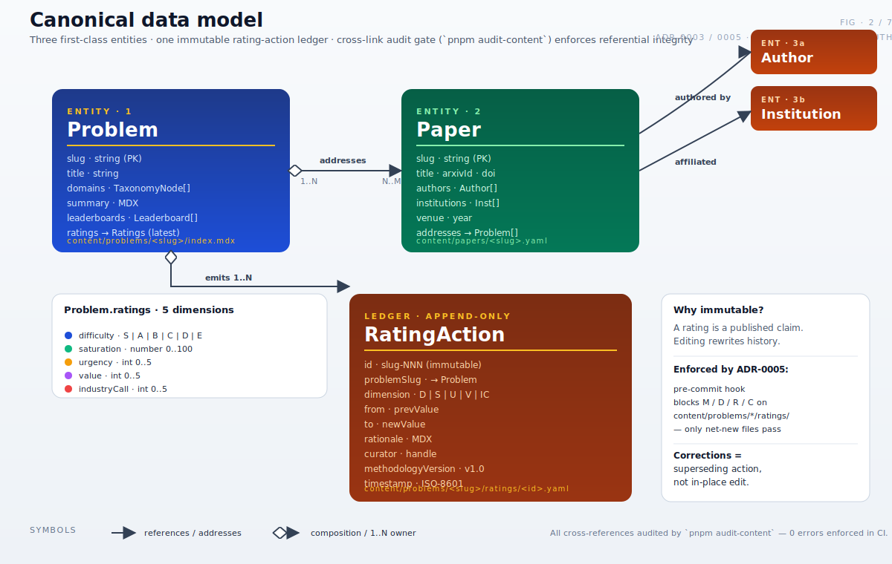
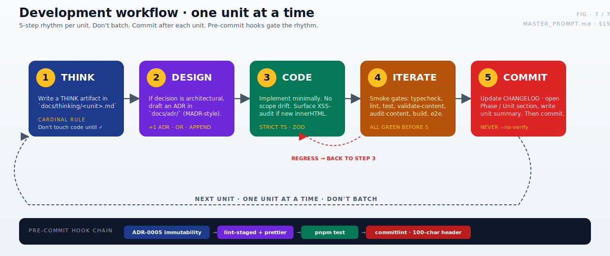

<!-- markdownlint-disable MD033 MD041 -->

<p align="center">
  
</p>

<h1 align="center">LLM&nbsp;OpenProblems</h1>

<p align="center">
  <b>A rated, taxonomy-organized encyclopedia of open problems in LLM &amp; AI research.</b><br/>
  Leaderboards · historical tracks · dynamic, agency-style ratings — <i>Difficulty · Saturation · Urgency · Value · Industry&nbsp;Call</i> — for every problem in every subdomain.
</p>

<p align="center">
  <a href="./MASTER_PROMPT.md"></a>
  <a href="#status"></a>
  <a href="./docs/adr/"></a>
  <a href="#status"></a>
  <a href="#status"></a>
  <a href="./LICENSE"></a>
  <a href="./content/LICENSE.md"></a>
</p>

<p align="center">
  <a href="#vision">Vision</a> ·
  <a href="#why-this-matters">Why this matters</a> ·
  <a href="#rating-methodology">Methodology</a> ·
  <a href="#status">Status</a> ·
  <a href="#architecture">Architecture</a> ·
  <a href="#data-model">Data model</a> ·
  <a href="#markdown-extension-framework">Markdown framework</a> ·
  <a href="#workflow">Workflow</a> ·
  <a href="#quick-start">Quick start</a> ·
  <a href="#contributing">Contributing</a>
</p>

---

> **What this is.** _LLM OpenProblems_ is the daily-go-to web platform for AI researchers — a living, citable encyclopedia of open research problems. Each problem carries five rating dimensions, each with a rationale, each with a revisable history. The methodology is meant to be publishable as a position paper.
>
> **Why now.** Papers&nbsp;with&nbsp;Code was sunsetted in July 2025. The community lost its canonical `⟨task, dataset, metric⟩` leaderboard graph. Hugging Face's _Trending Papers_ is feed-shaped, not problem-shaped. There is no rated ontology of open problems in AI research. This project fills that gap.
>
> **How it's built.** Next.js 15 + React 19 + TypeScript strict · Velite for file-first content · Turso libSQL + Drizzle ORM · NextAuth v5 multi-provider OAuth · `unified` + `rehype-sanitize` for server-only markdown · 24 accepted ADRs over 64 phases · governed end-to-end by [`MASTER_PROMPT.md`](./MASTER_PROMPT.md).

<!-- ─────────────────────────────────────────────────────────────── -->

## Vision

The site occupies the same conceptual slot for **AI research problems** that Moody's / S&P / Fitch occupy for sovereign debt: a third party that publishes **transparent, methodology-backed, time-stamped, revisable ratings** the community uses as a coordination signal.

Every page must serve three personas — _Surveyor_, _Frontier Pusher_, _Strategist_ — on every visit. The IA is judged against that contract.

<p align="center">
  
</p>

<!-- ─────────────────────────────────────────────────────────────── -->

## Why this matters

Six adjacent platforms; two orthogonal axes. The top-right quadrant — **problem-shaped AND rated with methodology** — is empty. That's the gap.

<p align="center">
  
</p>

|                                 | Problem-shaped | Rated (methodology) | Curated taxonomy | Revision history |     Active 2026      | Citable |
| ------------------------------- | :------------: | :-----------------: | :--------------: | :--------------: | :------------------: | :-----: |
| **★ LLM OpenProblems**          |       ✓        |          ✓          |        ✓         |        ✓         |          ✓           |    ✓    |
| Papers with Code                |       ✗        |          ◐          |        ✓         |        ✗         | _sunsetted Jul 2025_ |    ◐    |
| Hugging Face Trending Papers    |       ✗        |          ✗          |        ✗         |        ✗         |          ✓           |    ✗    |
| nlp-progress                    |       ◐        |          ✗          |        ✓         |        ◐         |       _stale_        |    ◐    |
| OpenReview                      |       ✗        |          ◐          |        ✗         |        ✓         |          ✓           |    ✓    |
| Semantic Scholar / arxiv-sanity |       ✗        |          ✗          |        ✗         |        ✗         |          ✓           |    ◐    |

Where the analogy ends and the differentiator begins: **the rating-action ledger**. Every change to a rating ships a net-new YAML file under `content/problems/<slug>/ratings/`, signed by a curator, time-stamped, methodology-versioned, and immutable per [ADR-0005](./docs/adr/0005-rating-action-immutability.md). A rating you cited in your paper last year is still there next year, byte-for-byte — and if it has been superseded, you can read the entire chain.

<!-- ─────────────────────────────────────────────────────────────── -->

## Rating methodology

Five dimensions, each scored independently, each with a rationale, each with a history.

<p align="center">
  
</p>

Ratings are **revisable**. Each change emits a **RatingAction** — an immutable, append-only record (rationale · curator · methodology version · timestamp) analogous to a credit-rating action notice. This is core to the brand and must not be diluted. Pre-commit hook [ADR-0005](./docs/adr/0005-rating-action-immutability.md) blocks any modify / delete / rename / copy on `content/problems/*/ratings/*.yaml` — **only net-new files pass**.

<!-- ─────────────────────────────────────────────────────────────── -->

## Status

**64 / 64 phases shipped** (Phase 0 → Phase 63, all ✅ closed). HEAD = [`fad1328`](./CHANGELOG.md) (2026-05-19). Phase 64 awaiting sign-off. **24 accepted ADRs.**

<p align="center">
  
</p>

### Smoke gates at HEAD

Re-measure to verify.

| Gate                    | Value                                                                                                                                                               |
| ----------------------- | ------------------------------------------------------------------------------------------------------------------------------------------------------------------- |
| `pnpm typecheck`        | clean                                                                                                                                                               |
| `pnpm lint`             | clean                                                                                                                                                               |
| `pnpm test`             | **1486 / 1486** across **75** vitest files                                                                                                                          |
| `pnpm validate-content` | content files green                                                                                                                                                 |
| `pnpm audit-content`    | 0 errors / 6 warnings (Q32 `related-problems-symmetry` baseline; **59 consecutive phases** at this baseline)                                                        |
| `pnpm build`            | First Load JS shared chunk = **103 kB** (UNCHANGED through every Phase 9-63 unit; 173 consecutive units); middleware bundle = **160 kB** (unchanged since Phase 12) |

### Rhythm at HEAD

Twenty-nine consecutive 5-unit framework-pattern phases (35–63); **forty-seven consecutive single-session phases** (17–63, with Phase 45's three docs-only parallel-session sub-units 45.0a/45.1a/45.4a interleaved; **ten consecutive single-session phases** Phase 54–63 — new longest single-session-phases run in project history); first _framework + 7 consumers + 7 expansions + 7 plugin-regex-extensions + 2 schema-extensions + 2 plugin-option-extensions + 9 `MARKDOWN_EXTENSIONS` single-value arms + sextuple-alias × 4 + 4-D-clauses-both-items-closed + D-clause-with-3-items-closed × 2 + D-clause-with-4-items-closed × 1 + consumer-with-4+-evolutions × 1 + refactor-only-phase × 1 + forward-compat-affordance-arc-completed × 1 + three-principal-axes-of-zero-rework-extension × 1 + three-consecutive-absolute-record-extension × 1_ **27-phase cluster** (37–63); full framework activation under default dispatch sustained from Phase 44 through Phase 63 (all 12 component-surface-slot triples active under 3-way default; **+4 five-consumer-same-slot triples on ALL 4 surfaces** under 7-way `wikilinks,tables,arxiv,doi,pubmed,orcid,biorxiv` default Phase 59+); ADR-0018 D-G is the **first ADR D-clause with 30 APPENDs** in project history (single-letter slot consumed through Z at Phase 42; two-letter slots D-AA → D-AU consumed Phase 43–63; **first 30-APPENDs milestone** crossed Phase 63); **33 consecutive phases without new B category** (Phase 31–63 = first 33-phase run); **173 consecutive 103 kB First Load JS units** (Phase 9 Unit 9.5 → Phase 63 Unit 63.4; 100-unit threshold crossed at Phase 48 Unit 48.3); **58 "Continue" override invocations** across Phases 6–63 (the documented §12 escape valve; **half-century-of-Continue-overrides milestone** crossed at Phase 55.0; **eighth invocation past the half-century threshold** at Phase 63.0); **28 consecutive no-new-ADR phases** (Phase 36–63; longest no-new-ADR streak in project history; ADR-0025 candidate slot open since Phase 35); **APPEND-deferral closure cadence sustained 22 phases** (Phase 42–63; longest sustained cadence in project history); **HALF-CENTURY-OF-NON-§13-PHASES MILESTONE** crossed at Phase 59 (50th NON-§13 phase); Phase 63 is the **54th NON-§13 phase**.

The framework now exhibits **seven distinct phase-shape patterns** (new-consumer · composition-infrastructure · cross-surface-expansion · plugin-regex-extension · schema-extension · **plugin-option-axis-evolution** · acceptance-gate). **Phase 62 introduced the third principal axis of zero-rework framework extension** — plugin-option axis joins registry-state axis (Phase 38+; 7 realizations) and plugin-body axis (Phase 46+; 7 realizations); **first state where the framework has three principal axes of zero-rework extension**. Phase 62 is the **first framework-refactor-only phase in project history** — pure plugin-signature refactor (`rehypeResolveWikilinks` evolved from `Plugin<[], Root>` to `Plugin<[ResolveWikilinksOptions?], Root>` with optional `buildHref?` plugin option and hoisted `DEFAULT_BUILD_HREF` byte-identical to Phase-38 shape); **first phase to ship a framework affordance ahead of curator demand signal** (plugin-option-ready-before-consumer-demand discipline established; generalizes Phase-57 / Phase-61 schema-ready-before-plugin one layer up to plugin signature). **Phase 63 is the first consumer of a forward-compat plugin-option affordance shipped in a prior phase** in project history (cross-entity wikilinks consuming the Phase-62 `buildHref` affordance via new `CROSS_ENTITY_BUILD_HREF` + `MARKDOWN_EXTENSIONS=wikilinks-cross-entity` arm); **first 2-phase forward-compat-affordance prerequisite-fulfillment arc completed** (Phase 62 prerequisite ship → Phase 63 consumption ship); **first registry-level realization of the plugin-option axis**; **first 2-realization for the plugin-option-axis** (Phase 62 signature + Phase 63 registry). **Wikilinks consumer gains 4th evolution post-first-ship** (Phase 42 + 46 + 62 + 63) — **first state where a consumer has 4+ evolutions** in project history; wikilinks becomes the deepest-evolved consumer in the framework. Phase 63 closes APPEND-D-L item 3 at **25-phase carryover** — **NEW LONGEST ABSOLUTE APPEND-DEFERRAL CLOSURE EVER OBSERVED** (extends Phase-62 24-phase record by 1 phase); **third consecutive phase to set the absolute-record** — first 3-consecutive-phase absolute-record-extension streak in project history (Phase 61 22-phase D-Q item 4 → Phase 62 24-phase D-L item 6 → Phase 63 25-phase D-L item 3). **D-L becomes first D-clause with 4-of-6 enumerated items closed** (items 1+2+3+6); **first D-clause with 4+ items closed** in project history (prior multi-item D-clauses reached 3-of-N at Phase 61 D-Q + Phase 62 D-L). Phase 63 also ships **`MARKDOWN_EXTENSIONS=wikilinks-cross-entity`** as the **first new single-value arm since Phase 58 bioRxiv** (8 → 9 arms; first 5-phase gap between single-value-arm additions). The plugin-regex-extension pattern remains at 7 realizations (Phase 60 ship); the constructor-arg-only zero-rework expansion pattern remains at 7 realizations (Phase 59 ship); the schema-extension pattern remains at 2 realizations (Phase 57 + 61). **The project now hosts TWO coexisting 7-realization framework patterns** (plugin-regex-extension + constructor-arg-only-zero-rework-expansion) **plus the new plugin-option axis at 2 realizations** — first state where the framework exhibits three principal axes of zero-rework extension AND two of them at 7-realization parity.

<details>
<summary><b>Full phase ledger (Phase 0 → 63 closed + Phase 64 pending)</b></summary>

| Phase  | Status                 | Theme                                                                                                                                                                   | Units         | Last commit | ADR / closure                                                                                                                                                                                                                                                                                                                                                                                                                                                                                                                                                                                                                                                                                                                                                                                                                                                                                                                                                                                                                                                                                                                                                                                                                                                                                                                                                                                                                                                                                                                                                                                                                                                                                                                                                                                                                                                                                                                                                                                                   |
| ------ | ---------------------- | ----------------------------------------------------------------------------------------------------------------------------------------------------------------------- | ------------- | ----------- | --------------------------------------------------------------------------------------------------------------------------------------------------------------------------------------------------------------------------------------------------------------------------------------------------------------------------------------------------------------------------------------------------------------------------------------------------------------------------------------------------------------------------------------------------------------------------------------------------------------------------------------------------------------------------------------------------------------------------------------------------------------------------------------------------------------------------------------------------------------------------------------------------------------------------------------------------------------------------------------------------------------------------------------------------------------------------------------------------------------------------------------------------------------------------------------------------------------------------------------------------------------------------------------------------------------------------------------------------------------------------------------------------------------------------------------------------------------------------------------------------------------------------------------------------------------------------------------------------------------------------------------------------------------------------------------------------------------------------------------------------------------------------------------------------------------------------------------------------------------------------------------------------------------------------------------------------------------------------------------------------------------- |
| 0      | ✅ closed              | Foundation                                                                                                                                                              | 13            | `62eb8eb`   | Stack, schemas, ADRs 0001–0005, App Router stub IA.                                                                                                                                                                                                                                                                                                                                                                                                                                                                                                                                                                                                                                                                                                                                                                                                                                                                                                                                                                                                                                                                                                                                                                                                                                                                                                                                                                                                                                                                                                                                                                                                                                                                                                                                                                                                                                                                                                                                                             |
| 1      | ✅ closed              | Core MVP                                                                                                                                                                | 13            | `fc17e23`   | Brand finalisation, Velite pipeline, first problems.                                                                                                                                                                                                                                                                                                                                                                                                                                                                                                                                                                                                                                                                                                                                                                                                                                                                                                                                                                                                                                                                                                                                                                                                                                                                                                                                                                                                                                                                                                                                                                                                                                                                                                                                                                                                                                                                                                                                                            |
| 2      | ✅ closed              | Papers / Authors / Institutions / Leaderboards                                                                                                                          | 13 + 7 hyg    | `1d9d67e`   | §13 30-paper floor; cross-link audit CI gate.                                                                                                                                                                                                                                                                                                                                                                                                                                                                                                                                                                                                                                                                                                                                                                                                                                                                                                                                                                                                                                                                                                                                                                                                                                                                                                                                                                                                                                                                                                                                                                                                                                                                                                                                                                                                                                                                                                                                                                   |
| 3      | ✅ closed              | Rating Dynamics & Trending                                                                                                                                              | 14 + 1        | `709679f`   | ADR-0006 (saturation N/A). Recompose UI; movers board.                                                                                                                                                                                                                                                                                                                                                                                                                                                                                                                                                                                                                                                                                                                                                                                                                                                                                                                                                                                                                                                                                                                                                                                                                                                                                                                                                                                                                                                                                                                                                                                                                                                                                                                                                                                                                                                                                                                                                          |
| 4      | ✅ closed              | DomainMap & Community                                                                                                                                                   | 14            | `37ed747`   | ADR-0007 (D3 import policy). DomainMap viz.                                                                                                                                                                                                                                                                                                                                                                                                                                                                                                                                                                                                                                                                                                                                                                                                                                                                                                                                                                                                                                                                                                                                                                                                                                                                                                                                                                                                                                                                                                                                                                                                                                                                                                                                                                                                                                                                                                                                                                     |
| 5      | ✅ closed              | Intelligence layer (LLM CLIs)                                                                                                                                           | 14 + 2        | `01a8903`   | ADR-0008 + ADR-0009. `ingest-arxiv`, `extract-leaderboard`.                                                                                                                                                                                                                                                                                                                                                                                                                                                                                                                                                                                                                                                                                                                                                                                                                                                                                                                                                                                                                                                                                                                                                                                                                                                                                                                                                                                                                                                                                                                                                                                                                                                                                                                                                                                                                                                                                                                                                     |
| 6      | ✅ closed              | Discussions                                                                                                                                                             | 11            | `bb8f816`   | ADR-0010. Giscus embed + GraphQL read-side.                                                                                                                                                                                                                                                                                                                                                                                                                                                                                                                                                                                                                                                                                                                                                                                                                                                                                                                                                                                                                                                                                                                                                                                                                                                                                                                                                                                                                                                                                                                                                                                                                                                                                                                                                                                                                                                                                                                                                                     |
| 7      | ✅ closed              | Bilingual rendering — infra + pilot                                                                                                                                     | 13            | `01862d2`   | ADR-0011. next-intl + sub-path + sibling-file storage.                                                                                                                                                                                                                                                                                                                                                                                                                                                                                                                                                                                                                                                                                                                                                                                                                                                                                                                                                                                                                                                                                                                                                                                                                                                                                                                                                                                                                                                                                                                                                                                                                                                                                                                                                                                                                                                                                                                                                          |
| 8      | ✅ closed ⚠️           | Bilingual rollout completion                                                                                                                                            | 10            | `c41cf31`   | **Unit 8.4 (HTML shell migration) deferred indefinitely.**                                                                                                                                                                                                                                                                                                                                                                                                                                                                                                                                                                                                                                                                                                                                                                                                                                                                                                                                                                                                                                                                                                                                                                                                                                                                                                                                                                                                                                                                                                                                                                                                                                                                                                                                                                                                                                                                                                                                                      |
| 9      | ✅ closed (§13 close)  | Auth + read+write API                                                                                                                                                   | 10            | `9f8ff19`   | ADR-0012 + ADR-0013. **§13 ledger CLOSED.**                                                                                                                                                                                                                                                                                                                                                                                                                                                                                                                                                                                                                                                                                                                                                                                                                                                                                                                                                                                                                                                                                                                                                                                                                                                                                                                                                                                                                                                                                                                                                                                                                                                                                                                                                                                                                                                                                                                                                                     |
| 10     | ✅ closed              | Profile page + Phase-9 UI polish                                                                                                                                        | 6             | `0a55bfd`   | First NON-§13 phase.                                                                                                                                                                                                                                                                                                                                                                                                                                                                                                                                                                                                                                                                                                                                                                                                                                                                                                                                                                                                                                                                                                                                                                                                                                                                                                                                                                                                                                                                                                                                                                                                                                                                                                                                                                                                                                                                                                                                                                                            |
| 11     | ✅ closed              | Rating-challenge submission                                                                                                                                             | 8             | `2df4290`   | Submission form + `ratingChallenge` table.                                                                                                                                                                                                                                                                                                                                                                                                                                                                                                                                                                                                                                                                                                                                                                                                                                                                                                                                                                                                                                                                                                                                                                                                                                                                                                                                                                                                                                                                                                                                                                                                                                                                                                                                                                                                                                                                                                                                                                      |
| 12     | ✅ closed              | Curator review pipeline                                                                                                                                                 | 9             | `201825f`   | ADR-0014. State machine + env-var authz (`LOP_CURATOR_LOGINS`).                                                                                                                                                                                                                                                                                                                                                                                                                                                                                                                                                                                                                                                                                                                                                                                                                                                                                                                                                                                                                                                                                                                                                                                                                                                                                                                                                                                                                                                                                                                                                                                                                                                                                                                                                                                                                                                                                                                                                 |
| 13     | ✅ closed              | Public visibility (Q58)                                                                                                                                                 | 7             | `c3e3cbf`   | Per-status visibility policy.                                                                                                                                                                                                                                                                                                                                                                                                                                                                                                                                                                                                                                                                                                                                                                                                                                                                                                                                                                                                                                                                                                                                                                                                                                                                                                                                                                                                                                                                                                                                                                                                                                                                                                                                                                                                                                                                                                                                                                                   |
| 14     | ✅ closed              | Public profile route `/[locale]/u/[handle]`                                                                                                                             | 9             | `34290d7`   | ADR-0015 (per-user privacy model).                                                                                                                                                                                                                                                                                                                                                                                                                                                                                                                                                                                                                                                                                                                                                                                                                                                                                                                                                                                                                                                                                                                                                                                                                                                                                                                                                                                                                                                                                                                                                                                                                                                                                                                                                                                                                                                                                                                                                                              |
| 15     | ✅ closed              | User-editable profile fields                                                                                                                                            | 9             | `7644a70`   | ADR-0016 (`displayName` + `bio` plain-text).                                                                                                                                                                                                                                                                                                                                                                                                                                                                                                                                                                                                                                                                                                                                                                                                                                                                                                                                                                                                                                                                                                                                                                                                                                                                                                                                                                                                                                                                                                                                                                                                                                                                                                                                                                                                                                                                                                                                                                    |
| 16     | ✅ closed              | Image override / avatar upload                                                                                                                                          | 9             | `2ea957b`   | ADR-0017 (Vercel Blob). Parallel-session phase.                                                                                                                                                                                                                                                                                                                                                                                                                                                                                                                                                                                                                                                                                                                                                                                                                                                                                                                                                                                                                                                                                                                                                                                                                                                                                                                                                                                                                                                                                                                                                                                                                                                                                                                                                                                                                                                                                                                                                                 |
| 17     | ✅ closed              | Markdown rendering in bio                                                                                                                                               | 8             | `ad951e4`   | ADR-0018 (`unified` + `rehype-sanitize`). First XSS-audit surface.                                                                                                                                                                                                                                                                                                                                                                                                                                                                                                                                                                                                                                                                                                                                                                                                                                                                                                                                                                                                                                                                                                                                                                                                                                                                                                                                                                                                                                                                                                                                                                                                                                                                                                                                                                                                                                                                                                                                              |
| 18     | ✅ closed              | Multi-surface markdown (review notes)                                                                                                                                   | 7             | `4915406`   | ADR-0018 D-G inheritance APPEND #1; Q71 closure; no new ADR.                                                                                                                                                                                                                                                                                                                                                                                                                                                                                                                                                                                                                                                                                                                                                                                                                                                                                                                                                                                                                                                                                                                                                                                                                                                                                                                                                                                                                                                                                                                                                                                                                                                                                                                                                                                                                                                                                                                                                    |
| 19     | ✅ closed              | EXIF stripping on uploaded images                                                                                                                                       | 6             | `87d11e6`   | ADR-0019 (`sharp` server-side; strip-all default); Q70 closure.                                                                                                                                                                                                                                                                                                                                                                                                                                                                                                                                                                                                                                                                                                                                                                                                                                                                                                                                                                                                                                                                                                                                                                                                                                                                                                                                                                                                                                                                                                                                                                                                                                                                                                                                                                                                                                                                                                                                                 |
| 20     | ✅ closed              | EXIF backfill operational script                                                                                                                                        | 5             | `f4f498e`   | `scripts/backfill-exif-strip.ts`; no new ADR. ADR-0019 D-E closure.                                                                                                                                                                                                                                                                                                                                                                                                                                                                                                                                                                                                                                                                                                                                                                                                                                                                                                                                                                                                                                                                                                                                                                                                                                                                                                                                                                                                                                                                                                                                                                                                                                                                                                                                                                                                                                                                                                                                             |
| 21     | ✅ closed              | Orphan-blob cleanup operational script                                                                                                                                  | 5             | `a5ee9e1`   | `scripts/cleanup-orphan-blobs.ts`; no new ADR.                                                                                                                                                                                                                                                                                                                                                                                                                                                                                                                                                                                                                                                                                                                                                                                                                                                                                                                                                                                                                                                                                                                                                                                                                                                                                                                                                                                                                                                                                                                                                                                                                                                                                                                                                                                                                                                                                                                                                                  |
| 22     | ✅ closed              | `emit-challenge-action` CLI                                                                                                                                             | 5             | `b353641`   | `scripts/emit-challenge-action.ts`; ADR-0014 D-D realization; no new ADR.                                                                                                                                                                                                                                                                                                                                                                                                                                                                                                                                                                                                                                                                                                                                                                                                                                                                                                                                                                                                                                                                                                                                                                                                                                                                                                                                                                                                                                                                                                                                                                                                                                                                                                                                                                                                                                                                                                                                       |
| 23     | ✅ closed              | Prior-action auto-fill + signals_considered auto-gather                                                                                                                 | 5             | `225d97f`   | 4th consecutive operational-script-keystone phase; no new ADR; 7th 0-migration phase.                                                                                                                                                                                                                                                                                                                                                                                                                                                                                                                                                                                                                                                                                                                                                                                                                                                                                                                                                                                                                                                                                                                                                                                                                                                                                                                                                                                                                                                                                                                                                                                                                                                                                                                                                                                                                                                                                                                           |
| 24     | ✅ closed              | Server-side resize + WebP forward + retroactive backfill                                                                                                                | 5             | `1f0cb08`   | 5th consecutive operational-script-keystone phase; no new ADR; 8th 0-migration phase.                                                                                                                                                                                                                                                                                                                                                                                                                                                                                                                                                                                                                                                                                                                                                                                                                                                                                                                                                                                                                                                                                                                                                                                                                                                                                                                                                                                                                                                                                                                                                                                                                                                                                                                                                                                                                                                                                                                           |
| 25     | ✅ closed              | 4 operational follow-ons bundled (methodology-version dynamic read + batch-emit + …)                                                                                    | 5             | `6127fb4`   | 6th consecutive operational-script-keystone phase; no new ADR; 9th 0-migration phase.                                                                                                                                                                                                                                                                                                                                                                                                                                                                                                                                                                                                                                                                                                                                                                                                                                                                                                                                                                                                                                                                                                                                                                                                                                                                                                                                                                                                                                                                                                                                                                                                                                                                                                                                                                                                                                                                                                                           |
| 26     | ✅ closed              | Per-challenge detail page                                                                                                                                               | 5             | `ddda758`   | First user-facing UX since Phase 18; Phase-11+13 carryover; no new ADR; 10th 0-migration phase.                                                                                                                                                                                                                                                                                                                                                                                                                                                                                                                                                                                                                                                                                                                                                                                                                                                                                                                                                                                                                                                                                                                                                                                                                                                                                                                                                                                                                                                                                                                                                                                                                                                                                                                                                                                                                                                                                                                 |
| 27     | ✅ closed              | Markdown rationale + "View details" listing links                                                                                                                       | 5             | `a34a38d`   | ADR-0018 D-G inheritance APPEND #2; rationale = 3rd sibling helper; no new ADR; 11th 0-migration phase.                                                                                                                                                                                                                                                                                                                                                                                                                                                                                                                                                                                                                                                                                                                                                                                                                                                                                                                                                                                                                                                                                                                                                                                                                                                                                                                                                                                                                                                                                                                                                                                                                                                                                                                                                                                                                                                                                                         |
| 28     | ✅ closed              | Multi-provider OAuth expansion                                                                                                                                          | 6             | `a1a2a1c`   | ADR-0020. Lifts ADR-0012 D-B single-provider restriction. 8-phase no-new-ADR streak ends; 12-phase carryover.                                                                                                                                                                                                                                                                                                                                                                                                                                                                                                                                                                                                                                                                                                                                                                                                                                                                                                                                                                                                                                                                                                                                                                                                                                                                                                                                                                                                                                                                                                                                                                                                                                                                                                                                                                                                                                                                                                   |
| 29     | ✅ closed              | Rating-action `dimensions.<dim>.rationale` markdown promotion                                                                                                           | 5             | `5ff8ea1`   | ADR-0018 D-G inheritance APPEND #3; actionRationale = 4th sibling; first content-side (Velite) markdown render.                                                                                                                                                                                                                                                                                                                                                                                                                                                                                                                                                                                                                                                                                                                                                                                                                                                                                                                                                                                                                                                                                                                                                                                                                                                                                                                                                                                                                                                                                                                                                                                                                                                                                                                                                                                                                                                                                                 |
| 30     | ✅ closed              | Subscriber-list email foundation                                                                                                                                        | 6             | `ac1a1ae`   | ADR-0021. Closes Phase-5 D-4 punt at **22+ phase carryover** — single longest patience-signal closure.                                                                                                                                                                                                                                                                                                                                                                                                                                                                                                                                                                                                                                                                                                                                                                                                                                                                                                                                                                                                                                                                                                                                                                                                                                                                                                                                                                                                                                                                                                                                                                                                                                                                                                                                                                                                                                                                                                          |
| 31     | ✅ closed              | Weekly digest scheduler + send template                                                                                                                                 | 6             | `da41ce2`   | ADR-0022. First Vercel Cron infrastructure; first scheduled-trigger API endpoint.                                                                                                                                                                                                                                                                                                                                                                                                                                                                                                                                                                                                                                                                                                                                                                                                                                                                                                                                                                                                                                                                                                                                                                                                                                                                                                                                                                                                                                                                                                                                                                                                                                                                                                                                                                                                                                                                                                                               |
| 32     | ✅ closed              | Stale verification-token cleanup job                                                                                                                                    | 4             | `79482c7`   | Phase-31 cron pattern reuse; Phase-30 B.15 item 4 closure; no new ADR.                                                                                                                                                                                                                                                                                                                                                                                                                                                                                                                                                                                                                                                                                                                                                                                                                                                                                                                                                                                                                                                                                                                                                                                                                                                                                                                                                                                                                                                                                                                                                                                                                                                                                                                                                                                                                                                                                                                                          |
| 33     | ✅ closed              | Per-user-account subscriptions                                                                                                                                          | 5             | `477e43d`   | ADR-0023. Q76 Option A FK column extension; subscriber-list arc completes Phase 30→31→32→33.                                                                                                                                                                                                                                                                                                                                                                                                                                                                                                                                                                                                                                                                                                                                                                                                                                                                                                                                                                                                                                                                                                                                                                                                                                                                                                                                                                                                                                                                                                                                                                                                                                                                                                                                                                                                                                                                                                                    |
| 34     | ✅ closed              | Q79 Profile A "manage my subscriptions" widget                                                                                                                          | 4             | `b52cdda`   | UX-only follow-on; 5-phase subscriber-list arc extends to Phase 34; no new ADR; **0-phase Q-carryover** (tightest).                                                                                                                                                                                                                                                                                                                                                                                                                                                                                                                                                                                                                                                                                                                                                                                                                                                                                                                                                                                                                                                                                                                                                                                                                                                                                                                                                                                                                                                                                                                                                                                                                                                                                                                                                                                                                                                                                             |
| 35     | ✅ closed              | Framework-only content moderation                                                                                                                                       | 5             | `90dee0f`   | ADR-0024. **First framework-only ADR**; Q68 expansion at 12+ phase carryover; `NoopModerator` default + 4-surface integration.                                                                                                                                                                                                                                                                                                                                                                                                                                                                                                                                                                                                                                                                                                                                                                                                                                                                                                                                                                                                                                                                                                                                                                                                                                                                                                                                                                                                                                                                                                                                                                                                                                                                                                                                                                                                                                                                                  |
| 36     | ✅ closed              | Per-user privacy opt-out                                                                                                                                                | 5             | `fdb577e`   | ADR-0015 D-A APPEND. Q64 at **15+ phase carryover** (longest open architectural Q post-Q68); 9th migration.                                                                                                                                                                                                                                                                                                                                                                                                                                                                                                                                                                                                                                                                                                                                                                                                                                                                                                                                                                                                                                                                                                                                                                                                                                                                                                                                                                                                                                                                                                                                                                                                                                                                                                                                                                                                                                                                                                     |
| 37     | ✅ closed              | Markdown schema-divergence framework                                                                                                                                    | 5             | `1b2f81f`   | ADR-0018 D-G APPEND #4. `MarkdownExtensionRegistry` + per-surface schema/plugin overrides; Q72 framework realization.                                                                                                                                                                                                                                                                                                                                                                                                                                                                                                                                                                                                                                                                                                                                                                                                                                                                                                                                                                                                                                                                                                                                                                                                                                                                                                                                                                                                                                                                                                                                                                                                                                                                                                                                                                                                                                                                                           |
| 38     | ✅ closed              | First concrete framework consumer (wikilinks per-actionRationale)                                                                                                       | 5             | `106fdc7`   | ADR-0018 D-G APPEND #5. `WikilinkExtensionRegistry` + `MARKDOWN_EXTENSIONS=wikilinks`; Class B.14 at 9+ phase carryover.                                                                                                                                                                                                                                                                                                                                                                                                                                                                                                                                                                                                                                                                                                                                                                                                                                                                                                                                                                                                                                                                                                                                                                                                                                                                                                                                                                                                                                                                                                                                                                                                                                                                                                                                                                                                                                                                                        |
| 39     | ✅ closed              | Second concrete framework consumer (GFM tables per-reviewNotes)                                                                                                         | 5             | `89c36a7`   | ADR-0018 D-G APPEND #6. `TablesExtensionRegistry` + `MARKDOWN_EXTENSIONS=tables`; first real-consumer exercise of override-replace.                                                                                                                                                                                                                                                                                                                                                                                                                                                                                                                                                                                                                                                                                                                                                                                                                                                                                                                                                                                                                                                                                                                                                                                                                                                                                                                                                                                                                                                                                                                                                                                                                                                                                                                                                                                                                                                                             |
| 40     | ✅ closed              | Multi-consumer composition infrastructure                                                                                                                               | 5             | `9b39a8c`   | ADR-0018 D-G APPEND #7. `CompositeExtensionRegistry` + multi-value `MARKDOWN_EXTENSIONS=wikilinks,tables`; Phase-38-prep D-11 closure.                                                                                                                                                                                                                                                                                                                                                                                                                                                                                                                                                                                                                                                                                                                                                                                                                                                                                                                                                                                                                                                                                                                                                                                                                                                                                                                                                                                                                                                                                                                                                                                                                                                                                                                                                                                                                                                                          |
| 41     | ✅ closed              | Third concrete framework consumer (arxiv per-rationale)                                                                                                                 | 5             | `939dcc6`   | ADR-0018 D-G APPEND #8. `ArxivExtensionRegistry` + `MARKDOWN_EXTENSIONS=arxiv` + `@types/mdast`; **3-of-3 slot demonstration COMPLETE** (remarkPlugins).                                                                                                                                                                                                                                                                                                                                                                                                                                                                                                                                                                                                                                                                                                                                                                                                                                                                                                                                                                                                                                                                                                                                                                                                                                                                                                                                                                                                                                                                                                                                                                                                                                                                                                                                                                                                                                                        |
| 42     | ✅ closed              | First cross-surface expansion — wikilinks → all 4 surfaces                                                                                                              | 5             | `99b4764`   | ADR-0018 D-G APPEND #9 (D-Z; **last single-letter slot**). `PHASE_38_DEFAULT_ENABLED_SURFACES` → all 4; APPEND-D-L item 1 closure (4-phase gap).                                                                                                                                                                                                                                                                                                                                                                                                                                                                                                                                                                                                                                                                                                                                                                                                                                                                                                                                                                                                                                                                                                                                                                                                                                                                                                                                                                                                                                                                                                                                                                                                                                                                                                                                                                                                                                                                |
| 43     | ✅ closed              | Second cross-surface expansion — tables → all 4 surfaces                                                                                                                | 5             | `eb32444`   | ADR-0018 D-G APPEND #10 (D-AA; **first two-letter slot**). `PHASE_39_DEFAULT_ENABLED_SURFACES` → all 4; APPEND-D-Q item 2 closure (4-phase gap).                                                                                                                                                                                                                                                                                                                                                                                                                                                                                                                                                                                                                                                                                                                                                                                                                                                                                                                                                                                                                                                                                                                                                                                                                                                                                                                                                                                                                                                                                                                                                                                                                                                                                                                                                                                                                                                                |
| 44     | ✅ closed              | Third cross-surface expansion — arxiv → all 4 (**per-consumer expansion arc COMPLETE**)                                                                                 | 5             | `a7e971b`   | ADR-0018 D-G APPEND #11 (D-AB). `PHASE_41_DEFAULT_ENABLED_SURFACES` → all 4; APPEND-D-Y item 1 closure (3-phase gap). **Full framework activation under default dispatch achieved**: all 3 consumers × all 4 surfaces × all 3 slots = 12 component-surface-slot triples active, conflict-free.                                                                                                                                                                                                                                                                                                                                                                                                                                                                                                                                                                                                                                                                                                                                                                                                                                                                                                                                                                                                                                                                                                                                                                                                                                                                                                                                                                                                                                                                                                                                                                                                                                                                                                                  |
| 45     | ✅ closed              | DOI sibling consumer in `remarkPlugins` (**first compositional same-slot case**)                                                                                        | 5 + 3 par     | `728d54e`   | ADR-0018 D-G APPEND #12 (D-AC). `DoiExtensionRegistry` + `MARKDOWN_EXTENSIONS=doi` (5th single-value arm). **First "two plugins in same slot on same surface" state** + **first 4-consumer composition under default dispatch**. APPEND-D-Y item 4 closure (4-phase carryover). +64 tests.                                                                                                                                                                                                                                                                                                                                                                                                                                                                                                                                                                                                                                                                                                                                                                                                                                                                                                                                                                                                                                                                                                                                                                                                                                                                                                                                                                                                                                                                                                                                                                                                                                                                                                                      |
| 46     | ✅ closed              | Wikilink alias syntax `[[slug\|display]]` (**first plugin-regex-extension**)                                                                                            | 5             | `429d188`   | ADR-0018 D-G APPEND #13 (D-AD). `WIKILINK_PATTERN` regex evolves additively; first "display-text divergence from slug" rendering; first alias-syntax surface. **Introduces the framework's 5th phase-shape pattern** (plugin-regex-extension within existing consumer). APPEND-D-L item 2 closure (**8-phase carryover** — longest D-L item closure to date). +27 tests.                                                                                                                                                                                                                                                                                                                                                                                                                                                                                                                                                                                                                                                                                                                                                                                                                                                                                                                                                                                                                                                                                                                                                                                                                                                                                                                                                                                                                                                                                                                                                                                                                                        |
| 47     | ✅ closed              | Arxiv alias syntax `[[arxiv:NNNN.NNNNN\|display]]` (**first dual-form regex**)                                                                                          | 5             | `7a0eada`   | ADR-0018 D-G APPEND #14 (D-AE). `ARXIV_PATTERN` evolves to dual-form regex (bracketed priority + bare fallback). **Second realization of the Phase-46 plugin-regex-extension phase-shape pattern** — slot-independence validated. **First "alias-syntax on a non-bracketed-base consumer"** + **first "dual-alias surface"** (rationale carries both wikilinks alias + arxiv alias). APPEND-D-Y item 5 closure (6-phase carryover). +26 tests.                                                                                                                                                                                                                                                                                                                                                                                                                                                                                                                                                                                                                                                                                                                                                                                                                                                                                                                                                                                                                                                                                                                                                                                                                                                                                                                                                                                                                                                                                                                                                                  |
| 48     | ✅ closed              | DOI alias syntax `[[doi:10.NNNN/xxx\|display]]` (**second dual-form regex**)                                                                                            | 5             | `6567e5f`   | ADR-0018 D-G APPEND #15 (D-AF). `DOI_PATTERN` evolves to dual-form regex. **Third realization of the Phase-46 plugin-regex-extension phase-shape pattern**; **second plugin-regex-extension on a `remarkPlugins` consumer** (first "two-consecutive-`remarkPlugins`-regex-extension phases" pair Phase 47 + 48). **First "selectively-applied lookahead in dual-form regex"** — bracketed has explicit `]]` terminator (no lookahead); bare preserves Phase-45 prose-friendly lookahead. **First "regex-extension on a most-sophisticated-prior-regex consumer"**. APPEND-D-AC item 2 closure (**3-phase carryover** — ties Phase-44 record; **fastest alias-syntax closure ever** at the time). +31 tests.                                                                                                                                                                                                                                                                                                                                                                                                                                                                                                                                                                                                                                                                                                                                                                                                                                                                                                                                                                                                                                                                                                                                                                                                                                                                                                     |
| 49     | ✅ closed              | DOI cross-surface expansion → all 4 surfaces (**fourth realization of constructor-arg-only**)                                                                           | 5             | `45fc919`   | ADR-0018 D-G APPEND #16 (D-AG). `PHASE_45_DEFAULT_ENABLED_SURFACES` → all 4 surfaces. **Fourth realization of the "constructor-arg-only zero-rework expansion" property** — **first 4-realization property** in project history; **completes the per-consumer all-4-surfaces arc**. **First "all 4 surfaces have same-slot composition" state** + **first "all 4 surfaces are triple-alias" state**. **First D-clause with BOTH items closed within the closure cadence** (D-AC: item 2 Phase 48 + cross-surface Phase 49). APPEND-D-AC cross-surface closure (4-phase carryover). +19 tests.                                                                                                                                                                                                                                                                                                                                                                                                                                                                                                                                                                                                                                                                                                                                                                                                                                                                                                                                                                                                                                                                                                                                                                                                                                                                                                                                                                                                                   |
| 50     | ✅ closed              | PubMed PMID sibling consumer (**5th concrete consumer**; **first 3rd-`remarkPlugins` consumer**)                                                                        | 5             | `9f83be8`   | ADR-0018 D-G APPEND #17 (D-AH). New `PubmedExtensionRegistry` + `MARKDOWN_EXTENSIONS=pubmed` (6th single-value arm; **first expansion of recognized-arms set since Phase 45**). **First 3-consumer same-slot composition** + **first 5-consumer composition under default dispatch** (**maximum-consumer-cardinality state**). **Regex-disjointness-as-sole-defense discipline scales from 2 to 3 same-slot consumers** without architectural change. APPEND-D-AC PubMed PMID item closure (5-phase carryover). +56 tests; +1 vitest file.                                                                                                                                                                                                                                                                                                                                                                                                                                                                                                                                                                                                                                                                                                                                                                                                                                                                                                                                                                                                                                                                                                                                                                                                                                                                                                                                                                                                                                                                      |
| 51     | ✅ closed              | PubMed PMID alias dual-form (**fourth realization**; **1-phase carryover record**)                                                                                      | 5             | `7ae4e8e`   | ADR-0018 D-G APPEND #18 (D-AI). `PUBMED_PATTERN` evolves to dual-form regex. **Fourth realization of the Phase-46 plugin-regex-extension phase-shape pattern** — **all 3 `remarkPlugins` consumers exhibit dual-form regex post-Phase 51**. **First "dual-form regex with inner alternation inside the bracketed branch"** (`pubmed:` OR `pmid:`). **First quadruple-alias surface** (rationale: wikilinks + arxiv + doi + pubmed aliases). **First "first-phase APPEND-deferral closure"** — **1-phase carryover** (Phase 50 → 51); **fastest APPEND-deferral closure ever observed** (beats prior 3-phase record). **First "immediate-successor same-thread-direction phase boundary"**. New Phase-50 PubMed alias deferral closure. +30 tests.                                                                                                                                                                                                                                                                                                                                                                                                                                                                                                                                                                                                                                                                                                                                                                                                                                                                                                                                                                                                                                                                                                                                                                                                                                                               |
| 52     | ✅ closed              | PubMed PMID cross-surface expansion → all 4 surfaces (**fifth realization** of constructor-arg-only)                                                                    | 5             | `8a8faac`   | ADR-0018 D-G APPEND #19 (D-AJ). `PHASE_50_DEFAULT_ENABLED_SURFACES` → all 4 surfaces. **Fifth realization of "constructor-arg-only zero-rework expansion" property** — **first 5-realization property in project history**. **Completes the per-consumer all-4-surfaces arc for ALL 5 Phase-37-framework consumers**. **First "all 4 surfaces are quadruple-alias" state** + **first "all 4 surfaces have 3-consumer same-slot composition" state** + **first "all 4 surfaces with 5-consumer composition under default dispatch" state**. **Fastest cross-surface-expansion APPEND-deferral closure ever observed** at 2-phase carryover (Phase 50 → 52; beats prior 3-phase Phase-41 → 44 record). Second D-clause with both items closed (D-AH). +21 tests.                                                                                                                                                                                                                                                                                                                                                                                                                                                                                                                                                                                                                                                                                                                                                                                                                                                                                                                                                                                                                                                                                                                                                                                                                                                  |
| 53     | ✅ closed              | Older-style category-prefixed arxiv IDs (**first non-alias plugin-regex-extension**; longest absolute closure record)                                                   | 5             | `216c42f`   | ADR-0018 D-G APPEND #20 (D-AK). `ARXIV_PATTERN` evolves with inner ID-class disjunction (modern + legacy). **Fifth realization of Phase-46 plugin-regex-extension phase-shape pattern** — **first 5-realization phase-shape pattern in project history**. **First state with TWO 5-realization framework patterns coexisting**. **First non-alias-syntax plugin-regex-extension**. **First inner-class disjunction in a dual-form regex**. **Second regex evolution on `remarkLinkArxivIds`** — **first plugin with 2 regex evolutions** in project history. **LONGEST ABSOLUTE APPEND-DEFERRAL CLOSURE EVER OBSERVED** at 12-phase carryover (Phase 41 → 53; beats prior 8-phase D-L item 2 record). First regex-evolution-only closure on `remarkPlugins`. +30 tests.                                                                                                                                                                                                                                                                                                                                                                                                                                                                                                                                                                                                                                                                                                                                                                                                                                                                                                                                                                                                                                                                                                                                                                                                                                         |
| 54     | ✅ closed              | ORCID auto-link consumer (**6th concrete consumer**; **first 4th-`remarkPlugins` consumer**)                                                                            | 5             | `ce24fa3`   | ADR-0018 D-G APPEND #21 (D-AL). NEW `OrcidExtensionRegistry` + `MARKDOWN_EXTENSIONS=orcid` (7th single-value arm; first expansion since Phase 50). **First 4-consumer same-slot composition** + **first 6-consumer composition under default dispatch** (**new maximum-consumer-cardinality state**). **Regex-disjointness-as-sole-defense discipline scales from 3 to 4 same-slot consumers** without architectural change. **First D-clause with FOUR items closed within the closure cadence** (D-AC: alias item 2 Phase 48 + cross-surface Phase 49 + PubMed PMID Phase 50 + ORCID Phase 54). **First "more than 20 APPENDs on a single D-clause" milestone**. APPEND-D-AC ORCID item closure at 9-phase carryover (second-longest absolute). +51 tests; +1 vitest file.                                                                                                                                                                                                                                                                                                                                                                                                                                                                                                                                                                                                                                                                                                                                                                                                                                                                                                                                                                                                                                                                                                                                                                                                                                    |
| 55     | ✅ closed              | ORCID alias dual-form (**sixth realization**; **first 6-realization phase-shape pattern**)                                                                              | 5             | `55bde0d`   | ADR-0018 D-G APPEND #22 (D-AM). `ORCID_PATTERN` evolves to dual-form regex. **Sixth realization of Phase-46 plugin-regex-extension phase-shape pattern** — **first 6-realization phase-shape pattern in project history**. **Fourth dual-form regex** in the framework. **All 4 `remarkPlugins` consumers exhibit dual-form regex post-Phase 55**. **First quintuple-alias surface** in project history (rationale: wikilinks + arxiv + doi + pubmed + orcid aliases). **Second "immediate-successor same-thread-direction phase boundary"** (Phase 54 → 55; first state where the pattern is observed twice). **Ties Phase-51 1-phase APPEND-deferral closure record** — cadence acceleration reaches theoretical floor (8 → 6 → 3 → 1 → 1 phases). **50th "Continue" override invocation** — half-century-of-Continue-overrides milestone. +27 tests.                                                                                                                                                                                                                                                                                                                                                                                                                                                                                                                                                                                                                                                                                                                                                                                                                                                                                                                                                                                                                                                                                                                                                         |
| 56     | ✅ closed              | ORCID cross-surface expansion → all 4 surfaces (**6th realization** of constructor-arg-only)                                                                            | 5             | `df64261`   | ADR-0018 D-G APPEND #23 (D-AN). `PHASE_54_DEFAULT_ENABLED_SURFACES` → all 4 surfaces. **Sixth realization of "constructor-arg-only zero-rework expansion" property** — **first 6-realization for that pattern in project history**. **First state with TWO coexisting 6-realization framework patterns** (plugin-regex-extension at 6 from Phase 55 + constructor-arg-only-expansion at 6 from Phase 56). **First "all 4 surfaces are quintuple-alias" state** + **first "all 4 surfaces have 4-consumer same-slot composition" state** + **first "all 4 surfaces with 6-consumer composition under default dispatch" state** — **first "all-surfaces saturated at maximum-consumer-cardinality" state** in project history. **Ties Phase-52 fastest cross-surface-expansion APPEND-deferral closure record** at 2-phase carryover (Phase 54 → 56). **Third D-clause with BOTH items closed within the closure cadence** (D-AL). +21 tests.                                                                                                                                                                                                                                                                                                                                                                                                                                                                                                                                                                                                                                                                                                                                                                                                                                                                                                                                                                                                                                                                     |
| 57     | ✅ closed              | Table-specific attributes (`colSpan`/`rowSpan`/`scope`) — **first schema-extension on `schemaOverrides` slot**                                                          | 5             | `2c3b9ff`   | ADR-0018 D-G APPEND #24 (D-AO). `GFM_TABLE_SCHEMA_OVERRIDES.attributes` evolves to add `colSpan`/`rowSpan`/`scope` entries on `<th>`/`<td>`. **First schema-override extension on the `schemaOverrides` slot kind** in project history. **First "schema-extension" phase-shape pattern** in project history — sibling to plugin-regex-extension; demonstrates consumer-extension is slot-kind-agnostic. **First evolution of `GFM_TABLE_SCHEMA_OVERRIDES` since Phase 39 ship** (18-phase constant-stability streak ends). **First state where all 3 framework slot kinds have been evolved post-Phase-39**. **NEW LONGEST ABSOLUTE APPEND-DEFERRAL CLOSURE EVER OBSERVED** at 18-phase carryover (Phase 39 → 57; beats prior 12-phase Phase 41 → 53 D-Y item 2 record). **First "schema-ready-before-plugin" pattern**. **First new phase-shape introduced since plugin-regex-extension Phase 46** (11-phase gap). +15 tests.                                                                                                                                                                                                                                                                                                                                                                                                                                                                                                                                                                                                                                                                                                                                                                                                                                                                                                                                                                                                                                                                                  |
| 58     | ✅ closed              | bioRxiv preprint consumer (**7th concrete consumer**; **first 5th-`remarkPlugins` consumer**)                                                                           | 5             | `af153b1`   | ADR-0018 D-G APPEND #25 (D-AP). NEW `BiorxivExtensionRegistry` + `MARKDOWN_EXTENSIONS=biorxiv` (8th single-value arm; first expansion since Phase 54). **First 5-consumer same-slot composition** + **first 7-consumer composition under default dispatch** (**new maximum-consumer-cardinality state**; rationale only). **Regex-disjointness-as-sole-defense discipline scales from 4 to 5 same-slot consumers** without architectural change (4 consecutive scaling realizations Phase 48 → 50 → 54 → 58). **First 7-consumer cardinality in the Phase-37-framework** (84 component-surface-slot positions; up from 72). **Consumer-first-ship cadence stabilized at 4-to-5-phase gaps** across 4 successive sibling-consumer closures (doi 4-phase → pubmed 5-phase → orcid 4-phase → biorxiv 4-phase). APPEND-D-AL bioRxiv consumer item closure at 4-phase carryover. **17-phase APPEND-deferral closure cadence** — new project record. +52 tests; +1 vitest file.                                                                                                                                                                                                                                                                                                                                                                                                                                                                                                                                                                                                                                                                                                                                                                                                                                                                                                                                                                                                                                       |
| 59     | ✅ closed              | bioRxiv cross-surface expansion → all 4 surfaces (**7th realization** of constructor-arg-only)                                                                          | 5             | `7924ca8`   | ADR-0018 D-G APPEND #26 (D-AQ). `PHASE_58_DEFAULT_ENABLED_SURFACES` → all 4 surfaces. **Seventh realization of "constructor-arg-only zero-rework expansion" property** — **first 7-realization for that pattern** (extends Phase-56 record 6 → 7). **First state where constructor-arg-only-expansion (7) exceeds plugin-regex-extension (6)** — first asymmetric state at depth-6+ tier. **Generalizes per-consumer all-4-surfaces arc to ALL 7 framework consumers**. **NEW FASTEST cross-surface-expansion closure record at 1-phase carryover** (extends 2-phase prior record by 1; first sub-2-phase cross-surface closure; cadence 4→4→3→4→2→2→1). **First cross-surface expansion shipped as immediate-next-thread after first-ship without intervening alias-syntax** — first reversed-order post-first-ship arc. **HALF-CENTURY-OF-NON-§13-PHASES MILESTONE** (50th NON-§13 phase; first 50-NON-§13-phase milestone; first 50-phase ledger-closure streak). First all-4-surfaces 5-consumer same-slot + first all-4-surfaces 7-consumer composition — **second "all-surfaces saturated at maximum-consumer-cardinality" state** (first was Phase 56 at 6-consumer). +21 tests.                                                                                                                                                                                                                                                                                                                                                                                                                                                                                                                                                                                                                                                                                                                                                                                                                         |
| 60     | ✅ closed              | bioRxiv display-text alias syntax (**7th realization** of plugin-regex-extension)                                                                                       | 5             | `05d6094`   | ADR-0018 D-G APPEND #27 (D-AR). `BIORXIV_PATTERN` evolves to dual-form regex. **Seventh realization of Phase-46 plugin-regex-extension phase-shape pattern** — **first 7-realization phase-shape pattern in project history** (extends Phase-55 record 6 → 7). **First state where both principal axes of zero-rework framework extension are at 7 realizations** — first TWO 7-realization framework patterns coexisting; re-equalizes Phase-59 asymmetric state at depth-7 tier. **Fifth dual-form regex** — **first 5-of-5 `remarkPlugins` consumers with dual-form regex**. **Fifth plugin-regex-extension on a `remarkPlugins` consumer** — first state where ALL 5 `remarkPlugins` consumers have had alias-syntax extensions. **First state where ALL 7 Phase-37-framework consumers have had ALL their applicable extensions resolved** — **framework's current capability ceiling** for the 7-consumer roster. **First all-4-surfaces sextuple-alias state** (wikilinks + arxiv + doi + pubmed + orcid + biorxiv aliases on every surface). **D-AP becomes 4th D-clause with BOTH items closed** + **first D-clause with both items closed in REVERSED order** (cross-surface-first then alias) + **first consecutive-phases two-item D-clause closure** (Phase 59 + Phase 60 resolve D-AP). +28 tests.                                                                                                                                                                                                                                                                                                                                                                                                                                                                                                                                                                                                                                                                                                |
| 61     | ✅ closed              | `<caption>` element schema-extension on tables (**2nd schema-extension realization**)                                                                                   | 5             | `34a7d92`   | ADR-0018 D-G APPEND #28 (D-AS). `GFM_TABLE_SCHEMA_OVERRIDES.tagNames` evolves to add `"caption"`. **Second realization of the Phase-57-derived schema-extension phase-shape pattern** — **first 2-realization for that pattern** (extends Phase-57 record 1 → 2). **First state where the schema-extension pattern is observed twice within the same consumer** (tables). **Tables consumer gains 3rd evolution** (Phase 43 cross-surface + Phase 57 attributes + Phase 61 caption). **First state where TWO consumers have 3+ evolutions each** — arxiv (Phase 44 + 47 + 53) + tables. **First phase to advance the framework beyond its Phase-60 capability ceiling** via new realization of an existing phase-shape pattern. **Schema-ready-before-plugin state extended from attributes (Phase 57) to tags (Phase 61)** — first TAG-addition schema-ready-before-plugin. **NEW LONGEST ABSOLUTE APPEND-DEFERRAL CLOSURE EVER OBSERVED** at **22-phase carryover** (Phase 39 → 61; extends Phase-57 18-phase record by 4 phases). **D-Q becomes first D-clause with 3-of-4 enumerated items closed** within the cadence (items 1 + 3 + 4 closed; only item 6 remaining); first D-clause with 3+ items closed in project history. **20-phase APPEND-deferral closure cadence** — new project record. +12 tests (6 + 6 in tables.test.ts).                                                                                                                                                                                                                                                                                                                                                                                                                                                                                                                                                                                                                                                                     |
| 62     | ✅ closed              | Plugin parameterization for wikilink-href-builder (**first framework-refactor-only phase**; **third principal axis of zero-rework framework extension introduced**)     | 5             | `3efb06e`   | ADR-0018 D-G APPEND #29 (D-AT). `rehypeResolveWikilinks` signature evolves from `Plugin<[], Root>` to `Plugin<[ResolveWikilinksOptions?], Root>` with optional `buildHref?: (slug: string) => string` plugin option + hoisted `DEFAULT_BUILD_HREF` byte-identical to Phase-38 hardcoded shape. **First framework-refactor-only phase in project history** — first-of-its-kind phase shape; pure framework-affordance addition (zero new realization of any existing phase-shape pattern AND zero new consumer behavior). **Third principal axis of zero-rework framework extension introduced** — plugin-option axis joins registry-state axis (Phase 38+; 7 realizations) and plugin-body axis (Phase 46+; 7 realizations); **first state where the framework has three principal axes of zero-rework extension** in project history. **Wikilinks consumer 3rd evolution post-first-ship** (Phase 42 + 46 + 62); **first state where THREE consumers have 3+ evolutions each** (arxiv + tables + wikilinks). **First phase to ship a framework affordance ahead of curator demand signal** — plugin-option-ready-before-consumer-demand discipline established (generalizes Phase-57 / Phase-61 schema-ready-before-plugin one layer up to plugin signature). APPEND-D-L item 6 closure at **24-phase carryover** — **NEW LONGEST ABSOLUTE APPEND-DEFERRAL CLOSURE RECORD** at the time (extends Phase-61 22-phase record by 2 phases); **second consecutive phase to set the absolute-record**. **D-L becomes second D-clause with 3-of-6 items closed**; **first state where TWO D-clauses have 3+ items closed each** (D-Q + D-L). **21-phase APPEND-deferral closure cadence** — new project record. +12 tests (7 plugin-option + 5 registry integration).                                                                                                                                                                                                                                                 |
| 63     | ✅ closed (HEAD)       | Cross-entity wikilinks consuming the Phase-62 `buildHref` affordance (**first forward-compat-affordance consumer**; **first registry-level plugin-option realization**) | 5             | `fad1328`   | ADR-0018 D-G APPEND #30 (D-AU). `WIKILINK_PATTERN` regex extends to capture optional `(entity-type):` prefix; `ResolveWikilinksOptions.buildHref` signature extends to `(slug, entityType?) => string`; new exported `CROSS_ENTITY_BUILD_HREF` routes `paper` → `/papers`, `author` → `/authors`, `institution` → `/institutions` (fallback `/problems`); `WikilinkExtensionRegistry` gains optional `{ buildHref }` ctor arg; new factory dispatch arm `wikilinks-cross-entity` (8 → 9 single-value arms). **First consumer of a forward-compat plugin-option affordance shipped in a prior phase** in project history; **first 2-phase forward-compat-affordance prerequisite-fulfillment arc completed** (Phase 62 prerequisite ship → Phase 63 consumption ship). **First registry-level realization of the plugin-option axis** — Phase 62 was a signature-only ship; **first 2-realization for the plugin-option-axis** (Phase 62 signature + Phase 63 registry). **Wikilinks consumer 4th evolution** post-first-ship (Phase 42 + 46 + 62 + 63); **first state where a consumer has 4+ evolutions** in project history (wikilinks becomes deepest-evolved consumer). **First new `MARKDOWN_EXTENSIONS` single-value arm since Phase 58 bioRxiv** (`wikilinks-cross-entity`; first 5-phase gap between single-value-arm additions). APPEND-D-L item 3 closure at **25-phase carryover** — **NEW LONGEST ABSOLUTE APPEND-DEFERRAL CLOSURE EVER OBSERVED** (extends Phase-62 24-phase record by 1 phase); **third consecutive phase to set the absolute-record**; **first 3-consecutive-phase absolute-record-extension streak** in project history (Phase 61 22-phase → Phase 62 24-phase → Phase 63 25-phase). **D-L becomes first D-clause with 4-of-6 items closed** (items 1+2+3+6); **first D-clause with 4+ items closed** in project history. **22-phase APPEND-deferral closure cadence** — new project record. +22 tests (11 plugin-body + 6 registry + 4 factory + 1 updated Phase-62 spy test). |
| **64** | ⏸ **pending sign-off** | Surface-specific table schemas (most-natural Phase-64 rank 1; APPEND-D-Q item 6 — last remaining D-Q deferral)                                                          | 1-2 (planned) | _t.b.d._    | Rank 1: per-surface schemaOverrides map constructor-arg evolution on `TablesExtensionRegistry`; **closure would make D-Q the first D-clause with ALL enumerated items closed** in project history. Rank 2: `<a class="wikilink">` styling (APPEND-D-L item 4; would advance D-L from 4-of-6 → 5-of-6; requires framework decision on multi-source schemaOverrides). Rank 3: 404 handling for unresolved wikilinks (APPEND-D-L item 5; **closure would complete D-L** if pursued after rank 2; build-time validation against `content/problems/` + `content/papers/` + `content/authors/` + `content/institutions/` (cross-entity-aware per Phase 63 ship) + render-time fallback). 10 ranked alternatives in `docs/thinking/63.4-phase-63-acceptance-gate.md`.                                                                                                                                                                                                                                                                                                                                                                                                                                                                                                                                                                                                                                                                                                                                                                                                                                                                                                                                                                                                                                                                                                                                                                                                                                                  |

</details>

**ADR distribution.** ADRs ship roughly every 3–5 phases on architectural surfaces — 0001-0005 (P0; foundation), 0006 (P3), 0007 (P4), 0008-0009 (P5), 0010 (P6), 0011 (P7), 0012-0013 (P9), 0014 (P12), 0015 (P14), 0016 (P15), 0017 (P16), 0018 (P17), 0019 (P19), 0020 (P28), 0021 (P30), 0022 (P31), 0023 (P33), 0024 (P35). **Twenty-eight consecutive no-new-ADR phases since Phase 35** — longest streak in project history (Phases 36-63). ADR-0025 candidate slot open since Phase 35 (concrete moderation provider). Phase 36-63 evolutions all landed via ADR-0018 D-G APPENDs (now **30 APPENDs**; **first 30-APPENDs milestone** crossed at Phase 63; single-letter slot consumed through Z at Phase 42; two-letter slots D-AA → D-AU consumed Phase 43-63).

<!-- ─────────────────────────────────────────────────────────────── -->

## Architecture

Five layers · file-first editorial state · DB-backed user state · server-only markdown · zero-DB through Phase 3.

<p align="center">
  
</p>

- **Framework** — Next.js 15 App Router + React 19 + TypeScript strict (`exactOptionalPropertyTypes: true`, `noUncheckedIndexedAccess: true`). ADR-0001.
- **Styling** — Tailwind v4 + shadcn/ui primitives + variable fonts (Inter / Source Serif 4 / JetBrains Mono).
- **Schemas** — Zod 4 as the source of truth in [`lib/schemas/`](./lib/schemas/). ADR-0003.
- **Content pipeline** — Velite 0.3 over MDX + YAML + JSON in [`content/`](./content/); Zod schemas duplicated in `velite.config.ts` to work around the Velite/Zod 4 internal-API incompatibility (Q31). ADR-0002.
- **Storage** — File-first ([`content/`](./content/)) for editorial state; Turso libSQL + Drizzle ORM for user state (`user` / `account` / `session` / `verificationToken` / `watchlist` / `ratingChallenge` / `subscriber`; **9 migrations**); Vercel Blob for user-uploaded avatars. ADR-0004 / ADR-0013 / ADR-0017.
- **Auth** — NextAuth.js v5 + multi-provider OAuth (GitHub + Google) + Drizzle adapter + DB sessions. ADR-0012 / ADR-0020.
- **i18n** — next-intl + sub-path routing (`/[locale]/...`) + sibling-file content (`*.fr.mdx`). **168 keys per locale**. ADR-0011.
- **Markdown** — `unified` + `remark-parse` + `remark-gfm` + `remark-rehype` + `rehype-sanitize` + `rehype-stringify` (server-only). **4 `dangerouslySetInnerHTML` surfaces; 4 XSS-audited helpers** (`renderBioMarkdown` + `renderReviewNotesMarkdown` + `renderRationaleMarkdown` + `renderActionRationaleMarkdown`). ADR-0018 + **30 D-G APPENDs**. Phase 37 introduced the `MarkdownExtensionRegistry` framework; Phases 38/39/41/45/50/54/58 added **7 concrete consumers** (wikilinks · tables · arxiv · doi · pubmed · orcid · bioRxiv); Phases 42/43/44/49/52/56/59 expanded all 7 to all 4 surfaces — **first state where ALL 7 framework consumers have all-4-surface coverage** post-Phase 59 (**7th realization of constructor-arg-only zero-rework expansion property**; first 7-realization for that pattern); Phase 45 introduced the **first compositional same-slot case** (arxiv + doi); Phase 50 introduced the **first 3-consumer same-slot composition** + **first 5-consumer composition under default dispatch**; Phase 54 introduced the **first 4-consumer same-slot composition**; Phase 58 introduced the **first 5-consumer same-slot composition** + **first 7-consumer composition under default dispatch**; Phase 59 generalized the 5-consumer same-slot + 7-consumer composition to all 4 surfaces (**second "all-surfaces saturated at maximum-consumer-cardinality" state**); Phases 46/47/48/51/55/60 introduced alias-syntax for wikilinks · arxiv · doi · pubmed · orcid · bioRxiv (**6 alias-syntax extensions**; **5 dual-form regex realizations** — all 5 `remarkPlugins` consumers exhibit dual-form regex post-Phase 60; **first 5-of-5 state**); Phase 53 introduced the **first non-alias-syntax plugin-regex-extension** (arxiv legacy ID-class; **first plugin with 2 regex evolutions**); Phase 57 + Phase 61 introduced **schema-extension** (Phase 57 tables attributes + Phase 61 tables caption; **first 2-realization for the schema-extension phase-shape pattern**; first state where the schema-extension pattern is observed twice within the same consumer). Plugin-regex-extension is the **first 7-realization phase-shape pattern in project history** (Phase 60 ship); combined with constructor-arg-only-zero-rework-expansion reaching 7 realizations at Phase 59, the project hosts **TWO coexisting 7-realization framework patterns** post-Phase 60. Phase 60 closed at the **framework's then-current capability ceiling** for the 7-consumer roster; **Phase 61 advanced the framework beyond Phase-60 capability ceiling** via new realization of an existing phase-shape pattern (2nd schema-extension). **Phase 62 introduced the third principal axis of zero-rework framework extension** — plugin-option axis joins registry-state + plugin-body axes; **first state where the framework has three principal axes of zero-rework extension**; pure plugin-signature refactor (`rehypeResolveWikilinks` evolves to `Plugin<[ResolveWikilinksOptions?], Root>` with `buildHref?` option + hoisted `DEFAULT_BUILD_HREF`); **first framework-refactor-only phase in project history**; **first phase to ship a framework affordance ahead of curator demand signal** (plugin-option-ready-before-consumer-demand discipline; generalizes schema-ready-before-plugin one layer up). **Phase 63 ships the first consumer of that affordance** via `CROSS_ENTITY_BUILD_HREF` routing `paper` → `/papers`, `author` → `/authors`, `institution` → `/institutions` + new `MARKDOWN_EXTENSIONS=wikilinks-cross-entity` arm (8 → 9 single-value arms; first new arm since Phase 58 bioRxiv); **first 2-phase forward-compat-affordance prerequisite-fulfillment arc completed** in project history; **first registry-level realization of the plugin-option axis**; **first 2-realization for the plugin-option-axis**. **Wikilinks consumer 4th evolution** post-first-ship (Phase 42 + 46 + 62 + 63); **first state where a consumer has 4+ evolutions** in project history. **NEW LONGEST ABSOLUTE APPEND-DEFERRAL CLOSURE RECORD** at 25-phase carryover (Phase 63 D-L item 3); **third consecutive phase to set the absolute-record**; **first 3-consecutive-phase absolute-record-extension streak** (Phase 61 22-phase → Phase 62 24-phase → Phase 63 25-phase). **D-L becomes first D-clause with 4-of-6 items closed** (items 1+2+3+6); **first D-clause with 4+ items closed** in project history.
- **Image processing** — `sharp@0.34.5` (server-side) in [`lib/storage/putAvatar`](./lib/storage/index.ts) for EXIF stripping + auto-rotation. ADR-0019.
- **Content moderation framework** — [`lib/moderation/`](./lib/moderation/) (5 files; Phase-35 framework-only ADR-0024): `ContentModerator` interface + `NoopModerator` default + 4-surface integration. `MODERATION_PROVIDER` env-var dispatch awaits ADR-0025.
- **Subscriber-list email** — [`lib/email/`](./lib/email/) (Phase 30 ADR-0021 foundation; Phase 31 ADR-0022 weekly digest scheduler via Vercel Cron; Phase 33 ADR-0023 per-user-account subscriptions). 3 email templates; 2 cron entries in [`vercel.json`](./vercel.json).
- **Discussions** — Giscus iframe (client) + GitHub GraphQL API (server). ADR-0010.
- **LLM curation** — `@anthropic-ai/sdk` powering [`scripts/ingest-arxiv.ts`](./scripts/ingest-arxiv.ts) and [`scripts/extract-leaderboard.ts`](./scripts/extract-leaderboard.ts). ADR-0008.
- **Testing** — Vitest 4 (unit + Storybook-stories-as-browser-tests) + Playwright 1.60 (e2e) + Lighthouse CI (perf / a11y / SEO ≥ 0.95).
- **Tooling** — pnpm 11 + ESLint 9 (flat) + Prettier 3 + Husky 9 + lint-staged + commitlint + drizzle-kit.
- **CI** — fast `verify` workflow (typecheck · lint · format · test · validate-content · audit-content · build · ADR-0005 immutability gate) and slow `e2e + lighthouse` workflow (required since Unit 1.12).

<!-- ─────────────────────────────────────────────────────────────── -->

## Data model

Three first-class entities and one immutable append-only ledger. Referential integrity is enforced by `pnpm audit-content` — a 0-errors CI gate.

<p align="center">
  
</p>

<!-- ─────────────────────────────────────────────────────────────── -->

## Markdown extension framework

The Phase 37 framework lets each markdown surface diverge from the base allow-list without forking the helper. As of Phase 63, **all 12 component-surface-slot triples are active under default dispatch + 4 five-consumer-same-slot triples on ALL 4 surfaces** (under 7-way default since Phase 59 — `remarkPlugins` carries `[arxiv, doi, pubmed, orcid, biorxiv]` on every surface; **second "all-surfaces saturated at maximum-consumer-cardinality" state**; first was Phase 56 at 6-consumer). Curators can opt INTO cross-entity wikilinks via the new `MARKDOWN_EXTENSIONS=wikilinks-cross-entity` arm (Phase 63 ship; 8 → 9 single-value arms). All conflict-free per APPEND-D-R. The framework now exhibits **seven distinct phase-shape patterns**:

1. **New-consumer** (Phases 38/39/41/45/50/54/58) — new file + new class + new plugin + new factory arm + new APPEND letter. **7 realizations**.
2. **Composition-infrastructure** (Phase 40) — `CompositeExtensionRegistry` + multi-value `MARKDOWN_EXTENSIONS` dispatch.
3. **Cross-surface-expansion** (Phases 42/43/44/49/52/56/59) — constructor-arg value-only change on `PHASE_NN_DEFAULT_ENABLED_SURFACES`; zero plugin/class/factory rework. **7 realizations**; **first 7-realization for that pattern** in project history (Phase 59 ship); **completes the per-consumer all-4-surfaces arc for ALL 7 framework consumers**. Phase 59 set **NEW FASTEST cross-surface-expansion closure record at 1-phase carryover** (first sub-2-phase cross-surface closure; cadence 4 → 4 → 3 → 4 → 2 → 2 → 1 phases).
4. **Plugin-regex-extension** (Phases 46/47/48/51/53/55/60) — in-place regex evolution on an existing plugin; backwards-compatible additive change; XSS-audit-via-text-node-escape; slot-independent (Phase 46 = `rehypePlugins`; Phases 47/48/51/53/55/60 = `remarkPlugins`). **7 realizations**; **first 7-realization phase-shape pattern in project history** (Phase 60 ship). **All 5 `remarkPlugins` consumers exhibit dual-form regex post-Phase 60** (arxiv + doi + pubmed + orcid + biorxiv; **first 5-of-5 state**). Phase 53 added the **first non-alias-syntax plugin-regex-extension** (arxiv legacy ID-class; first inner-class disjunction in a dual-form regex; first plugin with 2 regex evolutions). (The Phase-63 regex extension to capture `(entity-type):` prefix is counted under the cross-entity / plugin-option phase-shape rather than as an 8th plugin-regex-extension realization per Phase-63 prep doc D-decision.)
5. **Schema-extension** (Phase 57 + Phase 61) — in-place value evolution of an existing consumer's `schemaOverrides` constant; backwards-compatible additive allow-list extension; XSS-audit-via-value-restriction-tuple or text-only-element-allow. **2 realizations**; **first 2-realization for the schema-extension phase-shape pattern** in project history (Phase 61 ship; extends Phase-57 record 1 → 2). **First state where the schema-extension pattern is observed twice within the same consumer** (tables). **Tables consumer gains 3rd evolution post-first-ship** (Phase 43 cross-surface + Phase 57 attributes + Phase 61 caption). **Schema-ready-before-plugin state extended from attributes (Phase 57) to tags (Phase 61)** — first TAG-addition schema-ready-before-plugin.
6. **Plugin-option-axis-evolution** (Phase 62 + Phase 63) — **NEW Phase 62**; introduces the **third principal axis of zero-rework framework extension** (plugin-option axis joins registry-state axis Phase 38+ and plugin-body axis Phase 46+). Phase 62 ships the signature affordance (pure plugin-signature refactor: `rehypeResolveWikilinks` evolves to accept `buildHref?: (slug: string) => string` option with hoisted `DEFAULT_BUILD_HREF` byte-identical to Phase-38 shape; `WikilinkExtensionRegistry` UNCHANGED — bare-form emit preserved). Phase 63 ships the first consumer via `CROSS_ENTITY_BUILD_HREF` routing per entity-type + extended regex `(?:(entity-type):)?` prefix + `WikilinkExtensionRegistry` constructor arg for tuple-form emit + new factory dispatch arm `wikilinks-cross-entity`. **2 realizations** (Phase 62 signature + Phase 63 registry); **first 2-realization for the plugin-option-axis at the registry layer**. **First framework-refactor-only phase in project history** (Phase 62); **first phase to ship a framework affordance ahead of curator demand signal** (Phase 62 plugin-option-ready-before-consumer-demand discipline). **First consumer of a forward-compat plugin-option affordance shipped in a prior phase** (Phase 63); **first 2-phase forward-compat-affordance prerequisite-fulfillment arc completed** in project history (Phase 62 → Phase 63). **First registry-level realization of the plugin-option axis** (Phase 63 Unit 63.2). **Wikilinks consumer 4th evolution** post-first-ship (Phase 42 + 46 + 62 + 63); **first state where a consumer has 4+ evolutions** in project history (wikilinks = deepest-evolved consumer).
7. **Acceptance-gate** (each phase's Unit X.4) — gate-only commit + boundary-statement THINK doc.

Phase 47 introduced the **first dual-form regex** in the framework: alternation between bracketed `[[arxiv:NNNN.NNNNN|display]]` (priority) and bare `arxiv:NNNN.NNNNN` (fallback). Phase 48-55-60 added doi / pubmed / orcid / biorxiv dual-form regexes — **first 5-of-5 `remarkPlugins` consumers with dual-form regex** post-Phase 60. Phase 53 added the **first inner-class disjunction in a dual-form regex** (arxiv: modern `\d{4}\.\d{4,5}` OR legacy `[a-z]+(?:-[a-z]+)*(?:\.[A-Z-]+)?/\d{7}`). The alias-syntax closure cadence trajectory: **8 → 6 → 3 → 1 → 1 → 2** phases across the six realizations. **The project now hosts TWO coexisting 7-realization framework patterns** post-Phase 60 (plugin-regex-extension + constructor-arg-only-zero-rework-expansion) **plus the new plugin-option axis at 2 realizations** post-Phase 63 — **first state where the framework has three principal axes of zero-rework extension** (Phase 62 ship). Phase 60 closed at the framework's then-current capability ceiling; **Phase 61 advanced beyond it** via the 2nd schema-extension; **Phase 62 advanced further by introducing the third principal axis**; **Phase 63 shipped the first consumer of that new axis**. **NEW LONGEST ABSOLUTE APPEND-DEFERRAL CLOSURE RECORD** at 25-phase carryover (Phase 63 D-L item 3; extends Phase-62 24-phase record by 1 phase); **third consecutive phase to set the absolute-record**; **first 3-consecutive-phase absolute-record-extension streak** in project history (Phase 61 22-phase → Phase 62 24-phase → Phase 63 25-phase). **D-L becomes first D-clause with 4-of-6 items closed** (items 1+2+3+6); **first D-clause with 4+ items closed** in project history.

<p align="center">
  
</p>

The framework lives at [`lib/markdown/extensions/`](./lib/markdown/extensions/) (21 files): `MarkdownExtensionRegistry` interface + `DefaultExtensionRegistry` (Phase 37) + `WikilinkExtensionRegistry` (Phase 38; expanded Phase 42; alias-capable Phase 46) + `TablesExtensionRegistry` (Phase 39; expanded Phase 43; schema-extension Phase 57 — `colSpan`/`rowSpan`/`scope` attributes; schema-extension Phase 61 — `caption` tag) + `ArxivExtensionRegistry` (Phase 41; expanded Phase 44; alias-capable Phase 47 via dual-form regex; legacy ID-class Phase 53) + `CompositeExtensionRegistry` (Phase 40; single-source schemaOverrides rule per APPEND-D-C no-deep-merge) + `DoiExtensionRegistry` (Phase 45; expanded Phase 49; alias-capable Phase 48 via dual-form regex) + `PubmedExtensionRegistry` (Phase 50; alias-capable Phase 51 via dual-form regex with inner alternation; expanded Phase 52) + `OrcidExtensionRegistry` (Phase 54; alias-capable Phase 55 via dual-form regex; expanded Phase 56) + `BiorxivExtensionRegistry` (Phase 58 — 7th consumer; expanded Phase 59 to all 4 surfaces; alias-capable Phase 60 via dual-form regex).

### Collision-freedom discipline (Phase 47 established → Phase 48 regex-disjointness-as-sole-defense → … → Phase 58 scaled to 5 same-slot consumers → Phase 59 generalized 5-consumer to all 4 surfaces → Phase 60 held under dual-form extension at 5-consumer cardinality)

When adding new consumers or extending existing regexes, two layers of defense prevent cross-consumer interference: (1) **distinct pipeline stages** — `remarkPlugins` runs BEFORE `rehypePlugins`, so staged execution resolves any hypothetical regex overlap in favor of the earlier stage; (2) **distinct regex character classes** — wikilinks slug class `[a-z0-9-]+` excludes `:` `.` `/`; arxiv requires literal `arxiv:` prefix (both modern + legacy ID classes); doi requires literal `doi:` prefix + `10.<reg>/<suffix>`; pubmed requires literal `pubmed:`/`pmid:` prefix + pure digits; orcid requires literal `orcid:` prefix + 16-char hyphenated ID; bioRxiv requires literal `biorxiv:` prefix + `YYYY.MM.DD.NNNNNN` ID — all five `remarkPlugins` regexes literally cannot match the same string via distinct literal prefixes. For **same-slot consumers** (arxiv + doi + pubmed + orcid + biorxiv in `remarkPlugins`), the staged-execution defense is moot; regex character class disjointness becomes the **sole defense**. The **regex-disjointness-as-sole-defense discipline** has now been validated through twelve consecutive scaling/extension events (Phase 48 established for 2 consumers → Phase 49 generalized to all 4 surfaces → Phase 50 scaled to 3 same-slot consumers → Phase 51 held under dual-form extension → Phase 52 generalized 3-consumer to all 4 surfaces → Phase 53 held under inner-class disjunction → Phase 54 scaled to 4 same-slot consumers → Phase 55 held under dual-form extension at 4-consumer cardinality → Phase 56 generalized 4-consumer to all 4 surfaces → Phase 58 scaled to 5 same-slot consumers → **Phase 59 generalized 5-consumer to all 4 surfaces** → **Phase 60 held under dual-form extension at 5-consumer cardinality**). **All 10 pairs of 5 consumers** (arxiv-doi · arxiv-pubmed · arxiv-orcid · arxiv-biorxiv · doi-pubmed · doi-orcid · doi-biorxiv · pubmed-orcid · pubmed-biorxiv · orcid-biorxiv) are collision-free; discipline scales without architectural change. **4 consecutive scaling realizations** (Phase 48 → 50 → 54 → 58).

<!-- ─────────────────────────────────────────────────────────────── -->

## Workflow

One unit at a time. Don't batch. Commit after each unit. Pre-commit hooks gate the rhythm — never `--no-verify`.

<p align="center">
  
</p>

- Commit message header ≤ 100 chars (commitlint enforces). Prefix per [Conventional Commits](https://www.conventionalcommits.org/): `chore(phase-N): unit N.X — <title>` for scaffolding / infra; `docs(phase-N): ...` for docs-only units.
- Phase boundaries require explicit human sign-off per `MASTER_PROMPT.md` §12 (a "Continue" override is the documented escape valve; **56 invocations** across Phases 6–61 — half-century-of-Continue-overrides milestone crossed at Phase 55.0; **sixth invocation past the half-century threshold** at Phase 61.0). The Phase-45 entry boundary established the discipline that runtime "work without stopping" instructions do NOT supersede §12 — the auto-mode classifier denies commits claiming sign-off without a literal user "Continue" message in the transcript.
- Pre-commit hooks: ADR-0005 rating-action immutability check (blocks `M` / `D` / `R` / `C` on `content/problems/*/ratings/*.yaml` — only net-new files pass) → lint-staged → `pnpm test`. Never `--no-verify`.
- Windows note: Bash tool for git; PowerShell for `pnpm`. CRLF-only diffs are benign; `prettier-plugin-tailwindcss` reorders Tailwind classes on commit (do not revert).

<!-- ─────────────────────────────────────────────────────────────── -->

## Quick start

```bash
# Node 22, pnpm 11
pnpm install
pnpm dev               # velite → next dev on :3000
pnpm test              # vitest run (~14s · 1452 tests)
pnpm validate-content  # Zod check every YAML / JSON / MDX in content/
pnpm audit-content     # cross-link audit (paper / problem / author / institution refs)
pnpm build             # production build · should report 103 kB First Load JS
```

The env contract is at [`.env.example`](./.env.example) — currently empty values fall back to local-dev defaults. See _Operational gates_ below for the keys needed to bring up production.

### Common commands

| Command                                         | What it does                                                               |
| ----------------------------------------------- | -------------------------------------------------------------------------- |
| `pnpm dev`                                      | `velite` → `next dev`                                                      |
| `pnpm build`                                    | `velite` → `next build`                                                    |
| `pnpm typecheck`                                | `tsc --noEmit`                                                             |
| `pnpm test`                                     | Vitest                                                                     |
| `pnpm validate-content`                         | Validate every YAML / JSON file in `content/` against the Zod schemas      |
| `pnpm audit-content`                            | Cross-link audit (paper / problem / author / institution / entries refs)   |
| `pnpm ingest-arxiv`                             | arXiv → MDX draft pipeline (ADR-0008 / 0009; needs `ANTHROPIC_API_KEY`)    |
| `pnpm extract-leaderboard`                      | PDF → leaderboard-entry draft pipeline                                     |
| `pnpm backfill-exif-strip`                      | Retroactively strip EXIF from existing Vercel Blob avatars (Phase 20)      |
| `pnpm cleanup-orphan-blobs`                     | Reconcile Vercel Blob against `users.imageOverride` (Phase 21)             |
| `pnpm emit-challenge-action <id>`               | Scaffold a rating-action YAML from a curator-accepted challenge (Phase 22) |
| `pnpm db:generate` / `db:migrate` / `db:studio` | drizzle-kit (9 migrations to date)                                         |
| `pnpm lint` / `lint:fix`                        | ESLint 9                                                                   |
| `pnpm format` / `format:check`                  | Prettier 3                                                                 |
| `pnpm test:e2e`                                 | Playwright (chromium)                                                      |
| `pnpm lhci`                                     | Lighthouse CI                                                              |
| `pnpm storybook`                                | Storybook 10                                                               |

### Live preview options

Three ways to see the work without cloning the repo:

1. **Figures gallery (zero-config, GitHub Pages).** [`docs/figures/gallery.html`](./docs/figures/gallery.html) is a self-contained static page that presents all 8 figures with light/dark-mode-aware styling and a sticky in-page navigator. Drop the `docs/` folder into GitHub Pages (Settings → Pages → Source: `main` / `docs`) and the gallery is live at `https://<owner>.github.io/<repo>/figures/gallery.html` — no build, no server. The same page renders verbatim by opening the file locally.
2. **Full app (Vercel).** The stack is Next.js with React Server Components — the canonical zero-config target is **Vercel** (the master prompt assumes this). One-click deploy:

   [](https://vercel.com/new/clone?repository-url=https%3A%2F%2Fgithub.com%2Fjacobwucs%2FOpenProblems&project-name=llm-openproblems&repository-name=llm-openproblems)

3. **Components only (Storybook).** [`pnpm storybook`](./.storybook/) ships a Storybook 10 build (cards, badges, rating chips, charts) that can be deployed to GitHub Pages or Chromatic for design review without standing up the full app.

<!-- ─────────────────────────────────────────────────────────────── -->

## Operational gates (pending curator action)

Architecture is ≥90% complete; deployment unblock pending curator action on the operational side:

- **Q2 / Q3** — DNS + hosting decision (the stack assumes Vercel; `llm-openproblems.org` is the §5.10 placeholder).
- **Q54** — register the GitHub OAuth app and populate `AUTH_GITHUB_ID` + `AUTH_GITHUB_SECRET` + `AUTH_SECRET` (one app for prod, one for local dev).
- **Q55** — provision the production Turso DB and populate `TURSO_DATABASE_URL` + `TURSO_AUTH_TOKEN`.
- **Q69** — create the Vercel Blob store; `BLOB_READ_WRITE_TOKEN` is auto-injected by `vercel env pull`.
- **Q73** — register the Google OAuth app (Phase 23 ADR-0020) and populate `AUTH_GOOGLE_ID` + `AUTH_GOOGLE_SECRET`.
- **Q75** — verify the Resend sender domain (Phase 30 ADR-0021) and populate `RESEND_API_KEY` + `RESEND_FROM`.
- **Q77** — populate `CRON_SECRET` for Vercel Cron (Phase 31 ADR-0022) and configure the scheduled invocations.

See [`OPEN_QUESTIONS.md`](./OPEN_QUESTIONS.md) Q54 / Q55 / Q69 / Q73 / Q75 / Q77 for detailed operational unblock paths.

<!-- ─────────────────────────────────────────────────────────────── -->

## Reading order for new contributors

1. [`MASTER_PROMPT.md`](./MASTER_PROMPT.md) — the constitution. Read end-to-end before touching anything.
2. [`OPEN_QUESTIONS.md`](./OPEN_QUESTIONS.md) — load-bearing decisions awaiting the human (66 top-level Qs: 28 resolved + 4 lean + 34 open; UNCHANGED since Phase 36).
3. [`docs/PROGRESS_SUMMARY_2026-05-19_phase-61-close.md`](./docs/PROGRESS_SUMMARY_2026-05-19_phase-61-close.md) — narrative progress summary + remaining-workload estimate at Phase 61 close (supersedes the Phase-58-close summary; prior summaries remain as historical records).
4. [`docs/adr/`](./docs/adr/) — accepted architecture decisions (0001–0024). Each ADR is immutable post-acceptance; corrections ship as a superseding ADR per the ADR-0005 pattern. ADR-0018 D-G accumulates **28 APPENDs** documenting the markdown-extension framework family (first 28-APPENDs milestone crossed at Phase 61).
5. [`docs/CURATION_PROMPT.md`](./docs/CURATION_PROMPT.md) — the parallel-curator workflow contract.
6. [`docs/PAPER_INGEST_RUNBOOK.md`](./docs/PAPER_INGEST_RUNBOOK.md) — single-session step-by-step for the `ingest-arxiv` → review → commit pipeline.
7. The most recent [`docs/SESSION_HANDOFF_2026-05-19_phase-61-close.md`](./docs/SESSION_HANDOFF_2026-05-19_phase-61-close.md) — paste-into-fresh-session resume payload with the full live ledger (supersedes the Phase-58-close handoff; prior handoffs remain as historical records).
8. [`docs/thinking/`](./docs/thinking/) — per-unit THINK artifacts (§15.1 of the master prompt). The `<phase>.0-phase-N-prep.md` and `<phase>.<n>-phase-N-acceptance-gate.md` files frame each phase end-to-end.
9. [`CHANGELOG.md`](./CHANGELOG.md) — every unit with file paths and rationale (~13,000+ lines).
10. [`docs/figures/`](./docs/figures/) — SVG diagrams catalog (the eight figures embedded above + `gallery.html` for the GitHub-Pages-ready live preview).
11. [`CONTRIBUTING.md`](./CONTRIBUTING.md) — contribution rhythm, PR checklist, commit conventions, parallel-curator workflow.
12. [`SECURITY.md`](./SECURITY.md) — vulnerability-disclosure policy + scope by ADR surface.
13. [`CODE_OF_CONDUCT.md`](./CODE_OF_CONDUCT.md) — Contributor-Covenant 2.1 with project-specific notes on rating challenges and ADR debates.

<!-- ─────────────────────────────────────────────────────────────── -->

## Contributing

This is a multi-month, PhD-led research project governed end-to-end by [`MASTER_PROMPT.md`](./MASTER_PROMPT.md). The full guide lives in [`CONTRIBUTING.md`](./CONTRIBUTING.md); the headline rules:

- **Editorial content** — PRs against [`content/`](./content/) (problems, papers, authors, institutions, methodology) are welcome. Follow [`docs/CURATION_PROMPT.md`](./docs/CURATION_PROMPT.md) and the Zod schemas in [`lib/schemas/`](./lib/schemas/). New rating actions land as net-new YAML files only — ADR-0005 forbids in-place edits.
- **Code** — open an issue first if the change touches an ADR-shaped surface (auth, schemas, markdown allow-list, data model, rating methodology). Smaller fixes (typos, link corrections, dependency bumps) are PR-direct.
- **Discussion** — load-bearing architecture questions go into [`OPEN_QUESTIONS.md`](./OPEN_QUESTIONS.md), not a forum thread. Open questions carry forward across phases with explicit lean / resolved tags.
- **Security** — please use [`SECURITY.md`](./SECURITY.md) for private vulnerability disclosure rather than a public issue.
- **Community** — see [`CODE_OF_CONDUCT.md`](./CODE_OF_CONDUCT.md). Disagreement is welcome and expected; harassment is not.

### Roadmap (Phase 62 → 68+; framework-evolution tier)

The Phase 61 acceptance gate (`docs/thinking/61.4-phase-61-acceptance-gate.md`) enumerates **10 ranked Phase-62 candidate threads**. The most-natural cluster — Tier 1 — is autonomous-tractable plugin/regex/schema evolutions; each phase is ~3-5 units mirroring the Phase 41–61 shapes. Tier 2 introduces ADR-0025 (concrete moderation provider) and closes the 26+ phase no-new-ADR streak. **Framework-state note**: Phase 60 closed at the framework's current capability ceiling (all 7 consumers fully extended along both principal axes); Phase 61 demonstrated that existing phase-shape patterns can be extended with new realizations on different value-kinds within the same consumer. Phase 62+ candidates can introduce new realizations of existing patterns OR genuinely new phase-shape patterns. Approximate sequencing:

| Phase            | Theme                                                                                                         | Lean                                                                                                                                                                                                                                                                            |
| ---------------- | ------------------------------------------------------------------------------------------------------------- | ------------------------------------------------------------------------------------------------------------------------------------------------------------------------------------------------------------------------------------------------------------------------------- |
| **62 (pending)** | Plugin parameterization for wikilink-href-builder                                                             | Refactor `rehypeResolveWikilinks` plugin to accept entity-type parameter; APPEND-D-L item 6 closure; **first framework-refactor-only phase in project history** (if shipped without closing a deferred APPEND item directly); prerequisite for Phase 63 cross-entity wikilinks. |
| 63               | Cross-entity wikilinks `[[paper-id\|display]]` / `[[author-slug\|display]]` / `[[institution-slug\|display]]` | Closes APPEND-D-L item 3; depends on Phase 62 plugin parameterization landing first.                                                                                                                                                                                            |
| 64               | Surface-specific table schemas                                                                                | Closes APPEND-D-Q item 6 — the **last remaining D-Q deferral**; closure would make D-Q the **first D-clause with ALL enumerated items closed** in project history.                                                                                                              |
| 65               | `<a class="wikilink">` styling                                                                                | EITHER (a) ship plugin-only emit without schemaOverrides (rely on post-sanitize plugin-order discipline) OR (b) framework refactor for multi-source schemaOverrides — current APPEND-D-C forbids deep-merge; closes APPEND-D-L item 4.                                          |
| 66               | 404 handling for unresolved wikilinks                                                                         | Introduces build-time validation shape; closes APPEND-D-L item 5.                                                                                                                                                                                                               |
| 67               | **ADR-0025 concrete content-moderation provider**                                                             | Closes 28+ phase no-new-ADR streak (Phase 36-66); promotes `NoopModerator` default via `MODERATION_PROVIDER` env-var dispatch.                                                                                                                                                  |
| 68+              | OSF preprint consumer / bare-ID forms / legacy bioRxiv IDs                                                    | 8th concrete consumer · or · regex-evolution series across the 5 `remarkPlugins` consumers · driven by curator demand signals.                                                                                                                                                  |

**Aggregate remaining-workload estimate**: ~5 framework-cluster phases (62–66) × ~3-5 units ≈ **~20 units ≈ 4-5 full-day single-session sprints** to reach a state where all current APPEND-D-L / D-Y / D-Q / D-AC deferrals are closed (D-Q item 6 closure at Phase 64 would make D-Q the first D-clause with ALL enumerated items closed); Tier 2 adds ~2 phases × ~5 units (~10 units) for ADR-0025 + 8th consumer. Tier 3 (operational gates Q54/55/69/73/75/77) is ~6 phases × ~3-5 units ≈ 25 units of curator-dependent work to bring up production deploy (GitHub OAuth, Turso prod DB, Vercel Blob, Google OAuth, Resend domain, Cron secret). **Total framework + operational ≈ 55 units ≈ 12 single-session days** to deployable state (revised down from Phase-58-close estimate of 65 units, reflecting Phases 59-61's faster-than-projected advance — Phase 59's NEW FASTEST cross-surface closure record at 1-phase carryover collapsed the bioRxiv arc by 1 phase relative to pubmed/orcid arcs; Phase 61's schema-extension realization reframed Phase 62+ toward existing-pattern extension rather than new-consumer introduction). After that, the project shifts from framework-evolution-intensive to content-authoring-intensive (more seed problems, papers, rating actions, bilingual content). The framework's current capability ceiling (7 consumers × 4 surfaces × 3 slots; all 5 `remarkPlugins` consumers exhibiting dual-form regex; 2 schema-extension realizations on tables; first state where ALL 7 framework consumers fully extended along both principal axes at Phase 60; Phase 61 first phase to advance beyond Phase-60 ceiling) is sufficient to support the content workload through ~year 1 of public operation.

<!-- ─────────────────────────────────────────────────────────────── -->

## License

- **Code** (`app/`, `components/`, `lib/`, `scripts/`, configs) is licensed under **Apache-2.0** — see [`LICENSE`](./LICENSE).
- **Content** (`content/` — `taxonomy.yaml`, problems, papers, authors, institutions, methodology) is licensed under **CC-BY-4.0** — see [`content/LICENSE.md`](./content/LICENSE.md).

Q4 resolved in Unit 1.0 (2026-05-14); Apache-2.0 picked over MIT for the explicit patent grant, given the project intends a citable methodology paper.

<!-- ─────────────────────────────────────────────────────────────── -->

## Star history

<a href="https://star-history.com/#bettyguo/OpenProblems&Date">
  <picture>
    <source media="(prefers-color-scheme: dark)" srcset="https://api.star-history.com/svg?repos=bettyguo/OpenProblems&type=Date&theme=dark"/>
    <source media="(prefers-color-scheme: light)" srcset="https://api.star-history.com/svg?repos=bettyguo/OpenProblems&type=Date"/>
    
  </picture>
</a>

<!-- ─────────────────────────────────────────────────────────────── -->

<p align="center">
  <sub>Built one unit at a time · ~14,000+ CHANGELOG lines · 1452 tests · 103 kB First Load JS unchanged for 164 consecutive units.</sub><br/>
  <sub>Governed by <a href="./MASTER_PROMPT.md">MASTER_PROMPT.md</a> · authored under <a href="./docs/CURATION_PROMPT.md">CURATION_PROMPT.md</a> · 24 ADRs accepted · 62 phases shipped · Phase 62 pending · 56 "Continue" overrides invoked (sixth past half-century).</sub><br/>
  <sub>Open the figures gallery → <a href="./docs/figures/gallery.html"><code>docs/figures/gallery.html</code></a> · Deploy → <a href="https://vercel.com/new/clone?repository-url=https%3A%2F%2Fgithub.com%2Fjacobwucs%2FOpenProblems">Vercel</a></sub>
</p>
