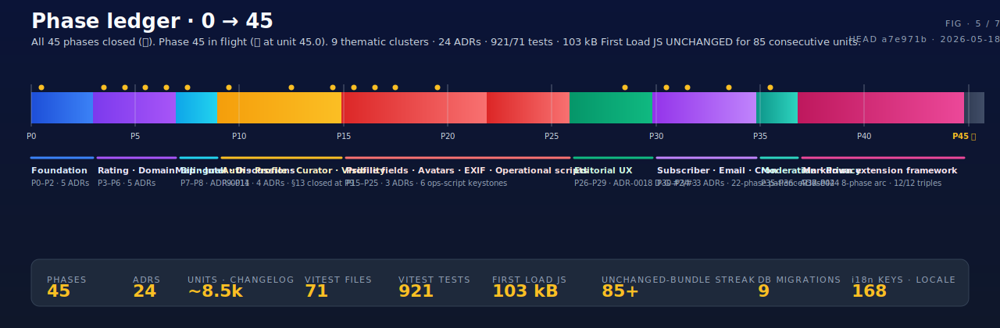
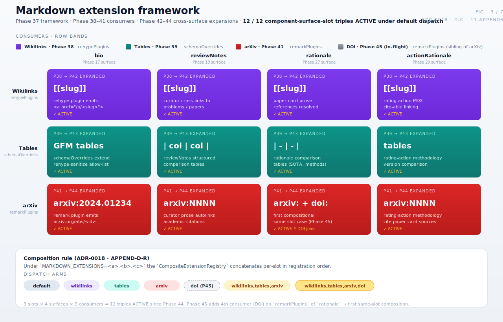

<!-- markdownlint-disable MD033 MD041 -->

<p align="center">
  
</p>

<h1 align="center">LLM&nbsp;OpenProblems</h1>

<p align="center">
  <b>A rated, taxonomy-organized encyclopedia of open problems in LLM &amp; AI research.</b><br/>
  Leaderboards · historical tracks · dynamic, agency-style ratings — <i>Difficulty · Saturation · Urgency · Value · Industry&nbsp;Call</i> — for every problem in every subdomain.
</p>

<p align="center">
  <a href="./MASTER_PROMPT.md"></a>
  <a href="#status"></a>
  <a href="./docs/adr/"></a>
  <a href="#status"></a>
  <a href="#status"></a>
  <a href="./LICENSE"></a>
  <a href="./content/LICENSE.md"></a>
</p>

<p align="center">
  <a href="#vision">Vision</a> ·
  <a href="#why-this-matters">Why this matters</a> ·
  <a href="#rating-methodology">Methodology</a> ·
  <a href="#status">Status</a> ·
  <a href="#architecture">Architecture</a> ·
  <a href="#data-model">Data model</a> ·
  <a href="#markdown-extension-framework">Markdown framework</a> ·
  <a href="#workflow">Workflow</a> ·
  <a href="#quick-start">Quick start</a> ·
  <a href="#contributing">Contributing</a>
</p>

---

> **What this is.** _LLM OpenProblems_ is the daily-go-to web platform for AI researchers — a living, citable encyclopedia of open research problems. Each problem carries five rating dimensions, each with a rationale, each with a revisable history. The methodology is meant to be publishable as a position paper.
>
> **Why now.** Papers&nbsp;with&nbsp;Code was sunsetted in July 2025. The community lost its canonical `⟨task, dataset, metric⟩` leaderboard graph. Hugging Face's _Trending Papers_ is feed-shaped, not problem-shaped. There is no rated ontology of open problems in AI research. This project fills that gap.
>
> **How it's built.** Next.js 15 + React 19 + TypeScript strict · Velite for file-first content · Turso libSQL + Drizzle ORM · NextAuth v5 multi-provider OAuth · `unified` + `rehype-sanitize` for server-only markdown · 24 accepted ADRs over 45 phases · governed end-to-end by [`MASTER_PROMPT.md`](./MASTER_PROMPT.md).

<!-- ─────────────────────────────────────────────────────────────── -->

## Vision

The site occupies the same conceptual slot for **AI research problems** that Moody's / S&P / Fitch occupy for sovereign debt: a third party that publishes **transparent, methodology-backed, time-stamped, revisable ratings** the community uses as a coordination signal.

Every page must serve three personas — _Surveyor_, _Frontier Pusher_, _Strategist_ — on every visit. The IA is judged against that contract.

<p align="center">
  
</p>

<!-- ─────────────────────────────────────────────────────────────── -->

## Why this matters

Six adjacent platforms; two orthogonal axes. The top-right quadrant — **problem-shaped AND rated with methodology** — is empty. That's the gap.

<p align="center">
  
</p>

|                                 | Problem-shaped | Rated (methodology) | Curated taxonomy | Revision history |     Active 2026      | Citable |
| ------------------------------- | :------------: | :-----------------: | :--------------: | :--------------: | :------------------: | :-----: |
| **★ LLM OpenProblems**          |       ✓        |          ✓          |        ✓         |        ✓         |          ✓           |    ✓    |
| Papers with Code                |       ✗        |          ◐          |        ✓         |        ✗         | _sunsetted Jul 2025_ |    ◐    |
| Hugging Face Trending Papers    |       ✗        |          ✗          |        ✗         |        ✗         |          ✓           |    ✗    |
| nlp-progress                    |       ◐        |          ✗          |        ✓         |        ◐         |       _stale_        |    ◐    |
| OpenReview                      |       ✗        |          ◐          |        ✗         |        ✓         |          ✓           |    ✓    |
| Semantic Scholar / arxiv-sanity |       ✗        |          ✗          |        ✗         |        ✗         |          ✓           |    ◐    |

Where the analogy ends and the differentiator begins: **the rating-action ledger**. Every change to a rating ships a net-new YAML file under `content/problems/<slug>/ratings/`, signed by a curator, time-stamped, methodology-versioned, and immutable per [ADR-0005](./docs/adr/0005-rating-action-immutability.md). A rating you cited in your paper last year is still there next year, byte-for-byte — and if it has been superseded, you can read the entire chain.

<!-- ─────────────────────────────────────────────────────────────── -->

## Rating methodology

Five dimensions, each scored independently, each with a rationale, each with a history.

<p align="center">
  
</p>

Ratings are **revisable**. Each change emits a **RatingAction** — an immutable, append-only record (rationale · curator · methodology version · timestamp) analogous to a credit-rating action notice. This is core to the brand and must not be diluted. Pre-commit hook [ADR-0005](./docs/adr/0005-rating-action-immutability.md) blocks any modify / delete / rename / copy on `content/problems/*/ratings/*.yaml` — **only net-new files pass**.

<!-- ─────────────────────────────────────────────────────────────── -->

## Status

**45 / 45 phases shipped** (Phase 0 → Phase 44, all ✅ closed). HEAD = [`a7e971b`](./CHANGELOG.md) (2026-05-18). Phase 45 in flight at Unit 45.0 (prep). **24 accepted ADRs.**

<p align="center">
  
</p>

### Smoke gates at HEAD

Re-measure to verify.

| Gate                    | Value                                                                                                                                                              |
| ----------------------- | ------------------------------------------------------------------------------------------------------------------------------------------------------------------ |
| `pnpm typecheck`        | clean                                                                                                                                                              |
| `pnpm lint`             | clean                                                                                                                                                              |
| `pnpm test`             | **921 / 921** across **71** vitest files                                                                                                                           |
| `pnpm validate-content` | content files green                                                                                                                                                |
| `pnpm audit-content`    | 0 errors / 6 warnings (Q32 `related-problems-symmetry` baseline)                                                                                                   |
| `pnpm build`            | First Load JS shared chunk = **103 kB** (UNCHANGED through every Phase 9-44 unit; 84 consecutive units); middleware bundle = **160 kB** (unchanged since Phase 12) |

### Rhythm at HEAD

Ten consecutive 5-unit framework-pattern phases (35–44); **twenty-eight consecutive single-session phases** (17–44); first _framework + 3 consumers + composition + 3 expansions_ 8-phase cluster (37–44); **full framework activation under default dispatch** achieved at Phase 44 (all 12 component-surface-slot triples active under 3-way `wikilinks,tables,arxiv` default; conflict-free per ADR-0018 APPEND-D-R); ADR-0018 D-G is the **first ADR D-clause with 11 APPENDs** in project history (single-letter slot consumed through Z at Phase 42; two-letter slots in use since Phase 43); **14 consecutive phases without new B category** (Phase 31–44 = first 14-phase run); **84 consecutive 103 kB First Load JS units** (Phase 9 Unit 9.5 → Phase 44 Unit 44.4); **39 "Continue" override invocations** across Phases 6–44 (the documented §12 escape valve).

<details>
<summary><b>Full phase ledger (Phase 0 → 44 + Phase 45 pending)</b></summary>

| Phase  | Status                 | Theme                                                                                   | Units       | Last commit | ADR / closure                                                                                                                                                                                                                                                                                  |
| ------ | ---------------------- | --------------------------------------------------------------------------------------- | ----------- | ----------- | ---------------------------------------------------------------------------------------------------------------------------------------------------------------------------------------------------------------------------------------------------------------------------------------------- |
| 0      | ✅ closed              | Foundation                                                                              | 13          | `62eb8eb`   | Stack, schemas, ADRs 0001–0005, App Router stub IA.                                                                                                                                                                                                                                            |
| 1      | ✅ closed              | Core MVP                                                                                | 13          | `fc17e23`   | Brand finalisation, Velite pipeline, first problems.                                                                                                                                                                                                                                           |
| 2      | ✅ closed              | Papers / Authors / Institutions / Leaderboards                                          | 13 + 7 hyg  | `1d9d67e`   | §13 30-paper floor; cross-link audit CI gate.                                                                                                                                                                                                                                                  |
| 3      | ✅ closed              | Rating Dynamics & Trending                                                              | 14 + 1      | `709679f`   | ADR-0006 (saturation N/A). Recompose UI; movers board.                                                                                                                                                                                                                                         |
| 4      | ✅ closed              | DomainMap & Community                                                                   | 14          | `37ed747`   | ADR-0007 (D3 import policy). DomainMap viz.                                                                                                                                                                                                                                                    |
| 5      | ✅ closed              | Intelligence layer (LLM CLIs)                                                           | 14 + 2      | `01a8903`   | ADR-0008 + ADR-0009. `ingest-arxiv`, `extract-leaderboard`.                                                                                                                                                                                                                                    |
| 6      | ✅ closed              | Discussions                                                                             | 11          | `bb8f816`   | ADR-0010. Giscus embed + GraphQL read-side.                                                                                                                                                                                                                                                    |
| 7      | ✅ closed              | Bilingual rendering — infra + pilot                                                     | 13          | `01862d2`   | ADR-0011. next-intl + sub-path + sibling-file storage.                                                                                                                                                                                                                                         |
| 8      | ✅ closed ⚠️           | Bilingual rollout completion                                                            | 10          | `c41cf31`   | **Unit 8.4 (HTML shell migration) deferred indefinitely.**                                                                                                                                                                                                                                     |
| 9      | ✅ closed (§13 close)  | Auth + read+write API                                                                   | 10          | `9f8ff19`   | ADR-0012 + ADR-0013. **§13 ledger CLOSED.**                                                                                                                                                                                                                                                    |
| 10     | ✅ closed              | Profile page + Phase-9 UI polish                                                        | 6           | `0a55bfd`   | First NON-§13 phase.                                                                                                                                                                                                                                                                           |
| 11     | ✅ closed              | Rating-challenge submission                                                             | 8           | `2df4290`   | Submission form + `ratingChallenge` table.                                                                                                                                                                                                                                                     |
| 12     | ✅ closed              | Curator review pipeline                                                                 | 9           | `201825f`   | ADR-0014. State machine + env-var authz (`LOP_CURATOR_LOGINS`).                                                                                                                                                                                                                                |
| 13     | ✅ closed              | Public visibility (Q58)                                                                 | 7           | `c3e3cbf`   | Per-status visibility policy.                                                                                                                                                                                                                                                                  |
| 14     | ✅ closed              | Public profile route `/[locale]/u/[handle]`                                             | 9           | `34290d7`   | ADR-0015 (per-user privacy model).                                                                                                                                                                                                                                                             |
| 15     | ✅ closed              | User-editable profile fields                                                            | 9           | `7644a70`   | ADR-0016 (`displayName` + `bio` plain-text).                                                                                                                                                                                                                                                   |
| 16     | ✅ closed              | Image override / avatar upload                                                          | 9           | `2ea957b`   | ADR-0017 (Vercel Blob). Parallel-session phase.                                                                                                                                                                                                                                                |
| 17     | ✅ closed              | Markdown rendering in bio                                                               | 8           | `ad951e4`   | ADR-0018 (`unified` + `rehype-sanitize`). First XSS-audit surface.                                                                                                                                                                                                                             |
| 18     | ✅ closed              | Multi-surface markdown (review notes)                                                   | 7           | `4915406`   | ADR-0018 D-G inheritance APPEND #1; Q71 closure; no new ADR.                                                                                                                                                                                                                                   |
| 19     | ✅ closed              | EXIF stripping on uploaded images                                                       | 6           | `87d11e6`   | ADR-0019 (`sharp` server-side; strip-all default); Q70 closure.                                                                                                                                                                                                                                |
| 20     | ✅ closed              | EXIF backfill operational script                                                        | 5           | `f4f498e`   | `scripts/backfill-exif-strip.ts`; no new ADR. ADR-0019 D-E closure.                                                                                                                                                                                                                            |
| 21     | ✅ closed              | Orphan-blob cleanup operational script                                                  | 5           | `a5ee9e1`   | `scripts/cleanup-orphan-blobs.ts`; no new ADR.                                                                                                                                                                                                                                                 |
| 22     | ✅ closed              | `emit-challenge-action` CLI                                                             | 5           | `b353641`   | `scripts/emit-challenge-action.ts`; ADR-0014 D-D realization; no new ADR.                                                                                                                                                                                                                      |
| 23     | ✅ closed              | Prior-action auto-fill + signals_considered auto-gather                                 | 5           | `225d97f`   | 4th consecutive operational-script-keystone phase; no new ADR; 7th 0-migration phase.                                                                                                                                                                                                          |
| 24     | ✅ closed              | Server-side resize + WebP forward + retroactive backfill                                | 5           | `1f0cb08`   | 5th consecutive operational-script-keystone phase; no new ADR; 8th 0-migration phase.                                                                                                                                                                                                          |
| 25     | ✅ closed              | 4 operational follow-ons bundled (methodology-version dynamic read + batch-emit + …)    | 5           | `6127fb4`   | 6th consecutive operational-script-keystone phase; no new ADR; 9th 0-migration phase.                                                                                                                                                                                                          |
| 26     | ✅ closed              | Per-challenge detail page                                                               | 5           | `ddda758`   | First user-facing UX since Phase 18; Phase-11+13 carryover; no new ADR; 10th 0-migration phase.                                                                                                                                                                                                |
| 27     | ✅ closed              | Markdown rationale + "View details" listing links                                       | 5           | `a34a38d`   | ADR-0018 D-G inheritance APPEND #2; rationale = 3rd sibling helper; no new ADR; 11th 0-migration phase.                                                                                                                                                                                        |
| 28     | ✅ closed              | Multi-provider OAuth expansion                                                          | 6           | `a1a2a1c`   | ADR-0020. Lifts ADR-0012 D-B single-provider restriction. 8-phase no-new-ADR streak ends; 12-phase carryover.                                                                                                                                                                                  |
| 29     | ✅ closed              | Rating-action `dimensions.<dim>.rationale` markdown promotion                           | 5           | `5ff8ea1`   | ADR-0018 D-G inheritance APPEND #3; actionRationale = 4th sibling; first content-side (Velite) markdown render.                                                                                                                                                                                |
| 30     | ✅ closed              | Subscriber-list email foundation                                                        | 6           | `ac1a1ae`   | ADR-0021. Closes Phase-5 D-4 punt at **22+ phase carryover** — single longest patience-signal closure.                                                                                                                                                                                         |
| 31     | ✅ closed              | Weekly digest scheduler + send template                                                 | 6           | `da41ce2`   | ADR-0022. First Vercel Cron infrastructure; first scheduled-trigger API endpoint.                                                                                                                                                                                                              |
| 32     | ✅ closed              | Stale verification-token cleanup job                                                    | 4           | `79482c7`   | Phase-31 cron pattern reuse; Phase-30 B.15 item 4 closure; no new ADR.                                                                                                                                                                                                                         |
| 33     | ✅ closed              | Per-user-account subscriptions                                                          | 5           | `477e43d`   | ADR-0023. Q76 Option A FK column extension; subscriber-list arc completes Phase 30→31→32→33.                                                                                                                                                                                                   |
| 34     | ✅ closed              | Q79 Profile A "manage my subscriptions" widget                                          | 4           | `b52cdda`   | UX-only follow-on; 5-phase subscriber-list arc extends to Phase 34; no new ADR; **0-phase Q-carryover** (tightest).                                                                                                                                                                            |
| 35     | ✅ closed              | Framework-only content moderation                                                       | 5           | `90dee0f`   | ADR-0024. **First framework-only ADR**; Q68 expansion at 12+ phase carryover; `NoopModerator` default + 4-surface integration.                                                                                                                                                                 |
| 36     | ✅ closed              | Per-user privacy opt-out                                                                | 5           | `fdb577e`   | ADR-0015 D-A APPEND. Q64 at **15+ phase carryover** (longest open architectural Q post-Q68); 9th migration.                                                                                                                                                                                    |
| 37     | ✅ closed              | Markdown schema-divergence framework                                                    | 5           | `1b2f81f`   | ADR-0018 D-G APPEND #4. `MarkdownExtensionRegistry` + per-surface schema/plugin overrides; Q72 framework realization.                                                                                                                                                                          |
| 38     | ✅ closed              | First concrete framework consumer (wikilinks per-actionRationale)                       | 5           | `106fdc7`   | ADR-0018 D-G APPEND #5. `WikilinkExtensionRegistry` + `MARKDOWN_EXTENSIONS=wikilinks`; Class B.14 at 9+ phase carryover.                                                                                                                                                                       |
| 39     | ✅ closed              | Second concrete framework consumer (GFM tables per-reviewNotes)                         | 5           | `89c36a7`   | ADR-0018 D-G APPEND #6. `TablesExtensionRegistry` + `MARKDOWN_EXTENSIONS=tables`; first real-consumer exercise of override-replace.                                                                                                                                                            |
| 40     | ✅ closed              | Multi-consumer composition infrastructure                                               | 5           | `9b39a8c`   | ADR-0018 D-G APPEND #7. `CompositeExtensionRegistry` + multi-value `MARKDOWN_EXTENSIONS=wikilinks,tables`; Phase-38-prep D-11 closure.                                                                                                                                                         |
| 41     | ✅ closed              | Third concrete framework consumer (arxiv per-rationale)                                 | 5           | `939dcc6`   | ADR-0018 D-G APPEND #8. `ArxivExtensionRegistry` + `MARKDOWN_EXTENSIONS=arxiv` + `@types/mdast`; **3-of-3 slot demonstration COMPLETE** (remarkPlugins).                                                                                                                                       |
| 42     | ✅ closed              | First cross-surface expansion — wikilinks → all 4 surfaces                              | 5           | `99b4764`   | ADR-0018 D-G APPEND #9 (D-Z; **last single-letter slot**). `PHASE_38_DEFAULT_ENABLED_SURFACES` → all 4; APPEND-D-L item 1 closure (4-phase gap).                                                                                                                                               |
| 43     | ✅ closed              | Second cross-surface expansion — tables → all 4 surfaces                                | 5           | `eb32444`   | ADR-0018 D-G APPEND #10 (D-AA; **first two-letter slot**). `PHASE_39_DEFAULT_ENABLED_SURFACES` → all 4; APPEND-D-Q item 2 closure (4-phase gap).                                                                                                                                               |
| 44     | ✅ closed (HEAD)       | Third cross-surface expansion — arxiv → all 4 (**per-consumer expansion arc COMPLETE**) | 5           | `a7e971b`   | ADR-0018 D-G APPEND #11 (D-AB). `PHASE_41_DEFAULT_ENABLED_SURFACES` → all 4; APPEND-D-Y item 1 closure (3-phase gap). **Full framework activation under default dispatch achieved**: all 3 consumers × all 4 surfaces × all 3 slots = 12 component-surface-slot triples active, conflict-free. |
| **45** | ⏸ **in flight (45.0)** | DOI sibling consumer in `remarkPlugins` slot — first compositional same-slot case       | 5 (planned) | `808e8d9`   | Rank 1: **DOI** auto-link on `rationale`; APPEND-D-AC anticipated; closes APPEND-D-Y item 4 at 4-phase carryover.                                                                                                                                                                              |

</details>

**ADR distribution.** ADRs ship roughly every 3–5 phases on architectural surfaces — 0001-0005 (P0; foundation), 0006 (P3), 0007 (P4), 0008-0009 (P5), 0010 (P6), 0011 (P7), 0012-0013 (P9), 0014 (P12), 0015 (P14), 0016 (P15), 0017 (P16), 0018 (P17), 0019 (P19), 0020 (P28), 0021 (P30), 0022 (P31), 0023 (P33), 0024 (P35). **Nine no-new-ADR phases since Phase 35** — longest streak in project history. ADR-0025 candidate slot open since Phase 35 (concrete moderation provider).

<!-- ─────────────────────────────────────────────────────────────── -->

## Architecture

Five layers · file-first editorial state · DB-backed user state · server-only markdown · zero-DB through Phase 3.

<p align="center">
  
</p>

- **Framework** — Next.js 15 App Router + React 19 + TypeScript strict (`exactOptionalPropertyTypes: true`, `noUncheckedIndexedAccess: true`). ADR-0001.
- **Styling** — Tailwind v4 + shadcn/ui primitives + variable fonts (Inter / Source Serif 4 / JetBrains Mono).
- **Schemas** — Zod 4 as the source of truth in [`lib/schemas/`](./lib/schemas/). ADR-0003.
- **Content pipeline** — Velite 0.3 over MDX + YAML + JSON in [`content/`](./content/); Zod schemas duplicated in `velite.config.ts` to work around the Velite/Zod 4 internal-API incompatibility (Q31). ADR-0002.
- **Storage** — File-first ([`content/`](./content/)) for editorial state; Turso libSQL + Drizzle ORM for user state (`user` / `account` / `session` / `verificationToken` / `watchlist` / `ratingChallenge` / `subscriber`; **9 migrations**); Vercel Blob for user-uploaded avatars. ADR-0004 / ADR-0013 / ADR-0017.
- **Auth** — NextAuth.js v5 + multi-provider OAuth (GitHub + Google) + Drizzle adapter + DB sessions. ADR-0012 / ADR-0020.
- **i18n** — next-intl + sub-path routing (`/[locale]/...`) + sibling-file content (`*.fr.mdx`). **168 keys per locale**. ADR-0011.
- **Markdown** — `unified` + `remark-parse` + `remark-gfm` + `remark-rehype` + `rehype-sanitize` + `rehype-stringify` (server-only). **4 `dangerouslySetInnerHTML` surfaces; 4 XSS-audited helpers** (`renderBioMarkdown` + `renderReviewNotesMarkdown` + `renderRationaleMarkdown` + `renderActionRationaleMarkdown`). ADR-0018 + **11 D-G APPENDs**.
- **Image processing** — `sharp@0.34.5` (server-side) in [`lib/storage/putAvatar`](./lib/storage/index.ts) for EXIF stripping + auto-rotation. ADR-0019.
- **Content moderation framework** — [`lib/moderation/`](./lib/moderation/) (5 files; Phase-35 framework-only ADR-0024): `ContentModerator` interface + `NoopModerator` default + 4-surface integration. `MODERATION_PROVIDER` env-var dispatch awaits ADR-0025.
- **Subscriber-list email** — [`lib/email/`](./lib/email/) (Phase 30 ADR-0021 foundation; Phase 31 ADR-0022 weekly digest scheduler via Vercel Cron; Phase 33 ADR-0023 per-user-account subscriptions). 3 email templates; 2 cron entries in [`vercel.json`](./vercel.json).
- **Discussions** — Giscus iframe (client) + GitHub GraphQL API (server). ADR-0010.
- **LLM curation** — `@anthropic-ai/sdk` powering [`scripts/ingest-arxiv.ts`](./scripts/ingest-arxiv.ts) and [`scripts/extract-leaderboard.ts`](./scripts/extract-leaderboard.ts). ADR-0008.
- **Testing** — Vitest 4 (unit + Storybook-stories-as-browser-tests) + Playwright 1.60 (e2e) + Lighthouse CI (perf / a11y / SEO ≥ 0.95).
- **Tooling** — pnpm 11 + ESLint 9 (flat) + Prettier 3 + Husky 9 + lint-staged + commitlint + drizzle-kit.
- **CI** — fast `verify` workflow (typecheck · lint · format · test · validate-content · audit-content · build · ADR-0005 immutability gate) and slow `e2e + lighthouse` workflow (required since Unit 1.12).

<!-- ─────────────────────────────────────────────────────────────── -->

## Data model

Three first-class entities and one immutable append-only ledger. Referential integrity is enforced by `pnpm audit-content` — a 0-errors CI gate.

<p align="center">
  
</p>

<!-- ─────────────────────────────────────────────────────────────── -->

## Markdown extension framework

The Phase 37 framework lets each markdown surface diverge from the base allow-list without forking the helper. As of Phase 44, **12 / 12 component-surface-slot triples** are active under default dispatch — conflict-free per APPEND-D-R. Phase 45 lands a 4th consumer (DOI auto-link), making `remarkPlugins` the first slot with two real consumers — the _first compositional same-slot case in project history_.

<p align="center">
  
</p>

The framework lives at [`lib/markdown/extensions/`](./lib/markdown/extensions/) (13 files): `MarkdownExtensionRegistry` interface + `DefaultExtensionRegistry` (Phase 37) + `WikilinkExtensionRegistry` (Phase 38; expanded Phase 42) + `TablesExtensionRegistry` (Phase 39; expanded Phase 43) + `ArxivExtensionRegistry` (Phase 41; expanded Phase 44) + `CompositeExtensionRegistry` (Phase 40).

<!-- ─────────────────────────────────────────────────────────────── -->

## Workflow

One unit at a time. Don't batch. Commit after each unit. Pre-commit hooks gate the rhythm — never `--no-verify`.

<p align="center">
  
</p>

- Commit message header ≤ 100 chars (commitlint enforces). Prefix per [Conventional Commits](https://www.conventionalcommits.org/): `chore(phase-N): unit N.X — <title>` for scaffolding / infra; `docs(phase-N): ...` for docs-only units.
- Phase boundaries require explicit human sign-off per `MASTER_PROMPT.md` §12 (a "Continue" override is the documented escape valve; **40 invocations** across Phases 6–45).
- Pre-commit hooks: ADR-0005 rating-action immutability check (blocks `M` / `D` / `R` / `C` on `content/problems/*/ratings/*.yaml` — only net-new files pass) → lint-staged → `pnpm test`. Never `--no-verify`.
- Windows note: Bash tool for git; PowerShell for `pnpm`. CRLF-only diffs are benign; `prettier-plugin-tailwindcss` reorders Tailwind classes on commit (do not revert).

<!-- ─────────────────────────────────────────────────────────────── -->

## Quick start

```bash
# Node 22, pnpm 11
pnpm install
pnpm dev               # velite → next dev on :3000
pnpm test              # vitest run (~14s · 921 tests)
pnpm validate-content  # Zod check every YAML / JSON / MDX in content/
pnpm audit-content     # cross-link audit (paper / problem / author / institution refs)
pnpm build             # production build · should report 103 kB First Load JS
```

The env contract is at [`.env.example`](./.env.example) — currently empty values fall back to local-dev defaults. See _Operational gates_ below for the keys needed to bring up production.

### Common commands

| Command                                         | What it does                                                               |
| ----------------------------------------------- | -------------------------------------------------------------------------- |
| `pnpm dev`                                      | `velite` → `next dev`                                                      |
| `pnpm build`                                    | `velite` → `next build`                                                    |
| `pnpm typecheck`                                | `tsc --noEmit`                                                             |
| `pnpm test`                                     | Vitest                                                                     |
| `pnpm validate-content`                         | Validate every YAML / JSON file in `content/` against the Zod schemas      |
| `pnpm audit-content`                            | Cross-link audit (paper / problem / author / institution / entries refs)   |
| `pnpm ingest-arxiv`                             | arXiv → MDX draft pipeline (ADR-0008 / 0009; needs `ANTHROPIC_API_KEY`)    |
| `pnpm extract-leaderboard`                      | PDF → leaderboard-entry draft pipeline                                     |
| `pnpm backfill-exif-strip`                      | Retroactively strip EXIF from existing Vercel Blob avatars (Phase 20)      |
| `pnpm cleanup-orphan-blobs`                     | Reconcile Vercel Blob against `users.imageOverride` (Phase 21)             |
| `pnpm emit-challenge-action <id>`               | Scaffold a rating-action YAML from a curator-accepted challenge (Phase 22) |
| `pnpm db:generate` / `db:migrate` / `db:studio` | drizzle-kit (9 migrations to date)                                         |
| `pnpm lint` / `lint:fix`                        | ESLint 9                                                                   |
| `pnpm format` / `format:check`                  | Prettier 3                                                                 |
| `pnpm test:e2e`                                 | Playwright (chromium)                                                      |
| `pnpm lhci`                                     | Lighthouse CI                                                              |
| `pnpm storybook`                                | Storybook 10                                                               |

### Live preview options

Three ways to see the work without cloning the repo:

1. **Figures gallery (zero-config, GitHub Pages).** [`docs/figures/gallery.html`](./docs/figures/gallery.html) is a self-contained static page that presents all 8 figures with light/dark-mode-aware styling and a sticky in-page navigator. Drop the `docs/` folder into GitHub Pages (Settings → Pages → Source: `main` / `docs`) and the gallery is live at `https://<owner>.github.io/<repo>/figures/gallery.html` — no build, no server. The same page renders verbatim by opening the file locally.
2. **Full app (Vercel).** The stack is Next.js with React Server Components — the canonical zero-config target is **Vercel** (the master prompt assumes this). One-click deploy:

   [](https://vercel.com/new/clone?repository-url=https%3A%2F%2Fgithub.com%2Fjacobwucs%2FOpenProblems&project-name=llm-openproblems&repository-name=llm-openproblems)

3. **Components only (Storybook).** [`pnpm storybook`](./.storybook/) ships a Storybook 10 build (cards, badges, rating chips, charts) that can be deployed to GitHub Pages or Chromatic for design review without standing up the full app.

<!-- ─────────────────────────────────────────────────────────────── -->

## Operational gates (pending curator action)

Architecture is ≥90% complete; deployment unblock pending curator action on the operational side:

- **Q2 / Q3** — DNS + hosting decision (the stack assumes Vercel; `llm-openproblems.org` is the §5.10 placeholder).
- **Q54** — register the GitHub OAuth app and populate `AUTH_GITHUB_ID` + `AUTH_GITHUB_SECRET` + `AUTH_SECRET` (one app for prod, one for local dev).
- **Q55** — provision the production Turso DB and populate `TURSO_DATABASE_URL` + `TURSO_AUTH_TOKEN`.
- **Q69** — create the Vercel Blob store; `BLOB_READ_WRITE_TOKEN` is auto-injected by `vercel env pull`.
- **Q73** — register the Google OAuth app (Phase 23 ADR-0020) and populate `AUTH_GOOGLE_ID` + `AUTH_GOOGLE_SECRET`.
- **Q75** — verify the Resend sender domain (Phase 30 ADR-0021) and populate `RESEND_API_KEY` + `RESEND_FROM`.
- **Q77** — populate `CRON_SECRET` for Vercel Cron (Phase 31 ADR-0022) and configure the scheduled invocations.

See [`OPEN_QUESTIONS.md`](./OPEN_QUESTIONS.md) Q54 / Q55 / Q69 / Q73 / Q75 / Q77 for detailed operational unblock paths.

<!-- ─────────────────────────────────────────────────────────────── -->

## Reading order for new contributors

1. [`MASTER_PROMPT.md`](./MASTER_PROMPT.md) — the constitution. Read end-to-end before touching anything.
2. [`OPEN_QUESTIONS.md`](./OPEN_QUESTIONS.md) — load-bearing decisions awaiting the human (66 top-level Qs: 28 resolved + 4 lean + 34 open; UNCHANGED since Phase 36).
3. [`docs/PROGRESS_SUMMARY_2026-05-18_phase-44-close.md`](./docs/PROGRESS_SUMMARY_2026-05-18_phase-44-close.md) — narrative progress summary + remaining-workload estimate at Phase 44 close.
4. [`docs/adr/`](./docs/adr/) — accepted architecture decisions (0001–0024). Each ADR is immutable post-acceptance; corrections ship as a superseding ADR per the ADR-0005 pattern. ADR-0018 D-G accumulates **11 APPENDs** documenting the markdown-extension framework family.
5. [`docs/CURATION_PROMPT.md`](./docs/CURATION_PROMPT.md) — the parallel-curator workflow contract.
6. [`docs/PAPER_INGEST_RUNBOOK.md`](./docs/PAPER_INGEST_RUNBOOK.md) — single-session step-by-step for the `ingest-arxiv` → review → commit pipeline.
7. The most recent [`docs/SESSION_HANDOFF_2026-05-18_phase-44-close.md`](./docs/SESSION_HANDOFF_2026-05-18_phase-44-close.md) — paste-into-fresh-session resume payload with the full live ledger.
8. [`docs/thinking/`](./docs/thinking/) — per-unit THINK artifacts (§15.1 of the master prompt). The `<phase>.0-phase-N-prep.md` and `<phase>.<n>-phase-N-acceptance-gate.md` files frame each phase end-to-end.
9. [`CHANGELOG.md`](./CHANGELOG.md) — every unit with file paths and rationale (~8500 lines).
10. [`docs/figures/`](./docs/figures/) — SVG diagrams catalog (the eight figures embedded above + `gallery.html` for the GitHub-Pages-ready live preview).
11. [`CONTRIBUTING.md`](./CONTRIBUTING.md) — contribution rhythm, PR checklist, commit conventions, parallel-curator workflow.
12. [`SECURITY.md`](./SECURITY.md) — vulnerability-disclosure policy + scope by ADR surface.
13. [`CODE_OF_CONDUCT.md`](./CODE_OF_CONDUCT.md) — Contributor-Covenant 2.1 with project-specific notes on rating challenges and ADR debates.

<!-- ─────────────────────────────────────────────────────────────── -->

## Contributing

This is a multi-month, PhD-led research project governed end-to-end by [`MASTER_PROMPT.md`](./MASTER_PROMPT.md). The full guide lives in [`CONTRIBUTING.md`](./CONTRIBUTING.md); the headline rules:

- **Editorial content** — PRs against [`content/`](./content/) (problems, papers, authors, institutions, methodology) are welcome. Follow [`docs/CURATION_PROMPT.md`](./docs/CURATION_PROMPT.md) and the Zod schemas in [`lib/schemas/`](./lib/schemas/). New rating actions land as net-new YAML files only — ADR-0005 forbids in-place edits.
- **Code** — open an issue first if the change touches an ADR-shaped surface (auth, schemas, markdown allow-list, data model, rating methodology). Smaller fixes (typos, link corrections, dependency bumps) are PR-direct.
- **Discussion** — load-bearing architecture questions go into [`OPEN_QUESTIONS.md`](./OPEN_QUESTIONS.md), not a forum thread. Open questions carry forward across phases with explicit lean / resolved tags.
- **Security** — please use [`SECURITY.md`](./SECURITY.md) for private vulnerability disclosure rather than a public issue.
- **Community** — see [`CODE_OF_CONDUCT.md`](./CODE_OF_CONDUCT.md). Disagreement is welcome and expected; harassment is not.

### Roadmap (Phase 45 → 46+)

| Phase              | Theme                                           | Lean                                                                       |
| ------------------ | ----------------------------------------------- | -------------------------------------------------------------------------- |
| **45 (in flight)** | DOI sibling consumer in `remarkPlugins` slot    | First compositional same-slot case; APPEND-D-AC; closes APPEND-D-Y item 4. |
| 46                 | DOI cross-surface expansion · or · 5th consumer | Mirrors Phase 42/43/44 expansion pattern.                                  |
| 47                 | ADR-0025 concrete moderation provider           | Closes the 10-phase no-new-ADR streak.                                     |
| 48+                | TBD — driven by curator demand signals          | Open ranked list in `SESSION_HANDOFF`.                                     |

<!-- ─────────────────────────────────────────────────────────────── -->

## License

- **Code** (`app/`, `components/`, `lib/`, `scripts/`, configs) is licensed under **Apache-2.0** — see [`LICENSE`](./LICENSE).
- **Content** (`content/` — `taxonomy.yaml`, problems, papers, authors, institutions, methodology) is licensed under **CC-BY-4.0** — see [`content/LICENSE.md`](./content/LICENSE.md).

Q4 resolved in Unit 1.0 (2026-05-14); Apache-2.0 picked over MIT for the explicit patent grant, given the project intends a citable methodology paper.

<!-- ─────────────────────────────────────────────────────────────── -->

## Star history

<a href="https://star-history.com/#jacobwucs/OpenProblems&Date">
  <picture>
    <source media="(prefers-color-scheme: dark)" srcset="https://api.star-history.com/svg?repos=jacobwucs/OpenProblems&type=Date&theme=dark"/>
    <source media="(prefers-color-scheme: light)" srcset="https://api.star-history.com/svg?repos=jacobwucs/OpenProblems&type=Date"/>
    
  </picture>
</a>

<!-- ─────────────────────────────────────────────────────────────── -->

<p align="center">
  <sub>Built one unit at a time · ~8500 CHANGELOG lines · 985 tests · 103 kB First Load JS unchanged for 89 consecutive units.</sub><br/>
  <sub>Governed by <a href="./MASTER_PROMPT.md">MASTER_PROMPT.md</a> · authored under <a href="./docs/CURATION_PROMPT.md">CURATION_PROMPT.md</a> · 24 ADRs accepted · Phase 45 in flight.</sub><br/>
  <sub>Open the figures gallery → <a href="./docs/figures/gallery.html"><code>docs/figures/gallery.html</code></a> · Deploy → <a href="https://vercel.com/new/clone?repository-url=https%3A%2F%2Fgithub.com%2Fjacobwucs%2FOpenProblems">Vercel</a></sub>
</p>
